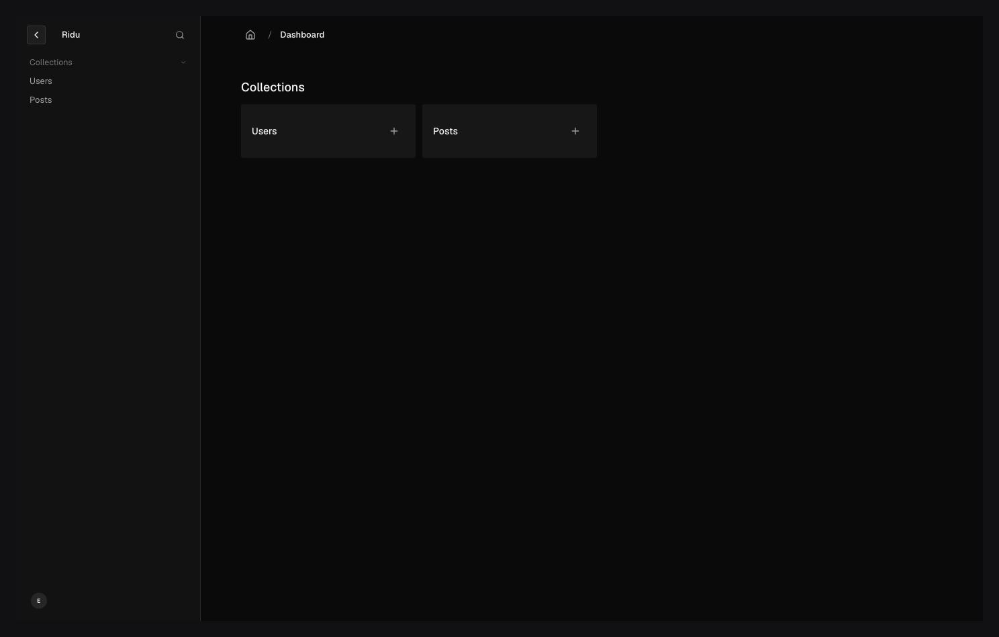

# Ridu

Ridu is a pre-1.0 Go content-management framework with an included Svelte 5 admin.
Define collections, fields, access rules, hooks, and plugins in Go; Ridu derives the selected
database schema and migrations, REST API, generated TypeScript contracts, Fetch SDK, and authoring
interface from that one executable configuration.

> [!IMPORTANT]
> Ridu is pre-1.0 software. Compatibility may change between minor releases, so evaluate it
> carefully before using it with production data. Ridu is available under the [MIT License](./LICENSE).



## Why Ridu

- **Go-defined content models.** Ridu resolves executable Go configuration into a deterministic,
  versioned schema manifest.
- **One operation engine.** Local Go calls, REST, the SDK, admin, tasks, and plugin transports share
  authorization, validation, hooks, transactions, population, and redaction.
- **One application binary.** The built Svelte admin is embedded in the Go server. npm, Bun, pnpm,
  or Yarn is used at build time, not as a production runtime.
- **Explicit extension points.** Backend plugins are compiled Go packages; admin plugins are
  statically registered Svelte and TypeScript modules.
- **Project tooling included.** The CLI creates projects, generates contracts, manages migrations,
  runs development, builds releases, and installs optional coding-agent guidance.

## Create a project

Open the npm initializer and choose **Starter** and **SQLite** for a service-free first run. After
the wizard finishes, run the commands it prints:

```sh
npm create ridu@latest my-app
cd my-app
npm install
npm run dev
```

The project records npm as its package manager and pins the matching `@riducms/cli` version. The
same flow works with `bun create`,
`pnpm create`, or `yarn create`; the project then uses that manager for development, checks, builds,
and plugin packages. Go users can instead install and run the same command directly:

```sh
go install github.com/riducms/ridu/cmd/ridu@latest
ridu new
```

Follow the [Quickstart](./website/src/content/docs/quickstart.md) to create the first user and
document, then read it through the generated TypeScript SDK. PostgreSQL and MongoDB setup, including
existing-project wiring and production limits, is covered by the public adapter guides.

## Try the source checkout

Building the source checkout requires Go 1.25 or newer and [Bun](https://bun.sh/) 1.4.0.

```sh
git clone https://github.com/riducms/ridu.git
cd ridu
bun install --frozen-lockfile
make demo
```

Open <http://127.0.0.1:8080/admin/login> and sign in with:

- email: `editor@riducms.test`
- password: `ridu-browser`

The demo uses an in-memory store and resets when it stops, so it does not require PostgreSQL.

Framework contributors can exercise the current checkout's scaffold instead of the registry CLI.
Choose a target directory that does not exist:

```sh
make dogfood-new TARGET=/tmp/ridu-dogfood-content
cd /tmp/ridu-dogfood-content
./.ridu/bin/ridu dev
```

To run the interactive Charm wizard against the current checkout, use:

```sh
make dogfood-new INTERACTIVE=1
```

The wizard asks where the project should live. Pass `TARGET=/tmp/ridu-interactive-content` as
well when you want to preselect the directory and proceed directly to the template choice.
Cancelling the wizard does not provision local packages or report a ready project.

Set `RIDU_ACCESSIBLE=1` to use stable plain-text prompts instead of the full terminal interface.
Routine CLI logs use muted short timestamps and a `[ridu]` scope; warnings and errors add an
explicit level, and only error timestamps are bold. Set `NO_COLOR` (an empty value is sufficient)
to disable their ANSI styling. During development Vite owns its warning/error formatting while Go
server output remains identifiable by a `[server]` badge.

## Documentation

- [Public documentation source](./website/src/content/docs/getting-started.md) and its
  [`website/`](./website/) presentation
- [Current capability status](./website/src/content/docs/status.md)
- [Release and compatibility policy](./website/src/content/docs/releases.md)
- [Security and trust boundaries](./website/src/content/docs/security.md)
- [Payload migration boundary](./website/src/content/guides/from-payload.md)

## Repository map

```text
cmd/ridu/                    project CLI
core/                        public application contracts and runtime coordination
field/, query/, schema/      public content-model and query contracts
store/, storage/             public persistence and object-storage contracts
internal/                    framework implementation
adapters/                    official database and object-storage adapters
plugins/                     official backend and paired admin plugins
admin/                       framework-owned Svelte admin
packages/                    npm CLI plus TypeScript protocol, SDK, build, UI, and plugin contracts
migration/                   source-neutral migration building blocks
tests/, testdata/            cross-surface contracts and fixtures
website/                     public product site, guides, and API reference
playground/                  isolated migration and component-evaluation applications
```

The root Go package is a thin ergonomic facade. Public leaf packages remain independent
of it, and production code never imports from the playground. The ownership rules contributors need
are summarized in [CONTRIBUTING.md](./CONTRIBUTING.md).

## Develop Ridu

```sh
bun install --frozen-lockfile
make check-dev
make check-fast
```

Use `make check-dev` for the ordinary edit loop. `make check-fast` adds generated-project
contracts and production frontend builds; run `make check-full` before handing off framework changes.
Before publishing, run `make release-check`; it also requires GoReleaser 2.18.0.

Read [CONTRIBUTING.md](./CONTRIBUTING.md) before changing public contracts. The intended Go module is
`github.com/riducms/ridu`, framework JavaScript packages use the `@riducms` npm scope, and the intended
public site is `https://riducms.com`. Releases are version-coordinated across Go, npm, and official
plugins; vulnerabilities should be reported through the private process in
[`SECURITY.md`](./.github/SECURITY.md).
