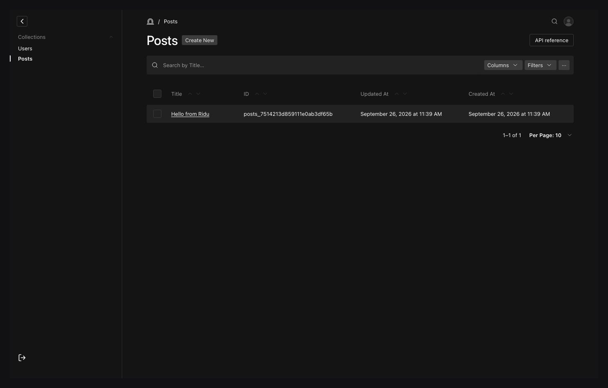

Open a collection list to search, filter, sort, select, and organize documents. Available columns,
workflow and locale states, and actions come from the resolved schema and the current actor's
capabilities.

## List configuration {#configuration}

| Option                            | What it controls                                                            |
| --------------------------------- | --------------------------------------------------------------------------- |
| `Collection.Admin.UseAsTitle`     | Direct field used for document labels and the default text search.          |
| `Collection.Admin.DefaultColumns` | Initial ordered field/metadata columns for the list.                        |
| `Collection.Admin.Group`          | Navigation section that contains the collection.                            |
| `Collection.Admin.Description`    | Explanatory copy above the collection workspace.                            |
| `Collection.Admin.FolderField`    | Direct singular relationship used by the folder filter.                     |
| `Collection.Admin.ParentField`    | Direct self-relationship used by the hierarchy view.                        |
| Field `.Index()`                  | Adds an adapter-owned index for a frequent supported filter or sort path.   |
| Collection and field access       | Determines visible documents, columns, filters, and permitted bulk actions. |

## Give the list a useful default {#configure}

```go title="content/posts.go"
ridu.Collection{
	Slug: "posts",
	Admin: ridu.CollectionAdmin{
		UseAsTitle:     "title",
		DefaultColumns: []string{"title", "status", "author", "updatedAt"},
		Group:          "Editorial",
		Description:    "Draft, review, and publish site articles.",
	},
	Fields: field.Fields{
		field.Text("title").Required(),
		field.Select("status", "draft", "review", "published"),
		field.Relationship("author", "users"),
	},
}
```

`UseAsTitle` and `DefaultColumns` must name compatible direct fields. They change presentation only;
the API path remains `/api/collections/posts`, and every list request still evaluates collection and
field access.

## Work in the list {#use-the-list}

Open **Posts** in the admin, then use the toolbar to:

1. search the configured title field;
2. open **Filters** to add typed conditions, join conditions with **and**, and add **or** groups;
3. use a column's ascending or descending button to sort, then choose 10, 25, 50, or 100 results
   per page below the table;
4. open **Columns** to show or hide ID, timestamps, status, nested group paths, relationships, and
   uploads, and drag the column pills into the order you want; and
5. select the current page or resolve a bounded filtered selection for bulk work.

Search and the current folder or status choice combine with the filter groups. The **More** menu
holds folder and hierarchy controls when configured, plus personal saved views when signed in.
Column order includes hidden columns, so showing one again restores its place. A saved view captures
the current list setup; it does not create a shared view for other users.

The URL owns page, search, sort, filters, columns, locale, folder, hierarchy, and trash state. Reloading or
sharing an allowed URL reproduces the workspace rather than resetting to hidden component state.
Per-user column/page-size choices and saved views use authenticated preferences.

Relationship and upload cells resolve readable labels through access-checked requests. A redacted
field stays redacted in the table even if another user saved it as a visible column.



Choose **API reference** in the collection header to inspect list, read, create, update, and delete
requests for this collection. It shows TypeScript SDK, cURL, and Go local API examples, field
details, query options, and example responses. The examples are for inspection and copying; they
do not submit a request.

## Empty, failed, and large result sets {#troubleshooting}

- Clear the current search, filters, folder, locale, and trash mode before assuming content is gone.
- A list can be empty because the collection access rule contributed a database predicate. The admin
  cannot reveal the number of inaccessible documents.
- Bulk resolution accepts at most 100 unique IDs. Narrow the filter or work in reviewed batches.
- A field absent from column/filter/sort choices may be a presentation field, unsupported nested
  shape, computed output, or denied by field access.

Continue with [Saved views and hierarchy](/docs/saved-views-and-hierarchy/) and
[Bulk actions and trash](/docs/bulk-and-trash/). See [Querying data](/docs/querying/) for the same
portable filter vocabulary outside the admin.
