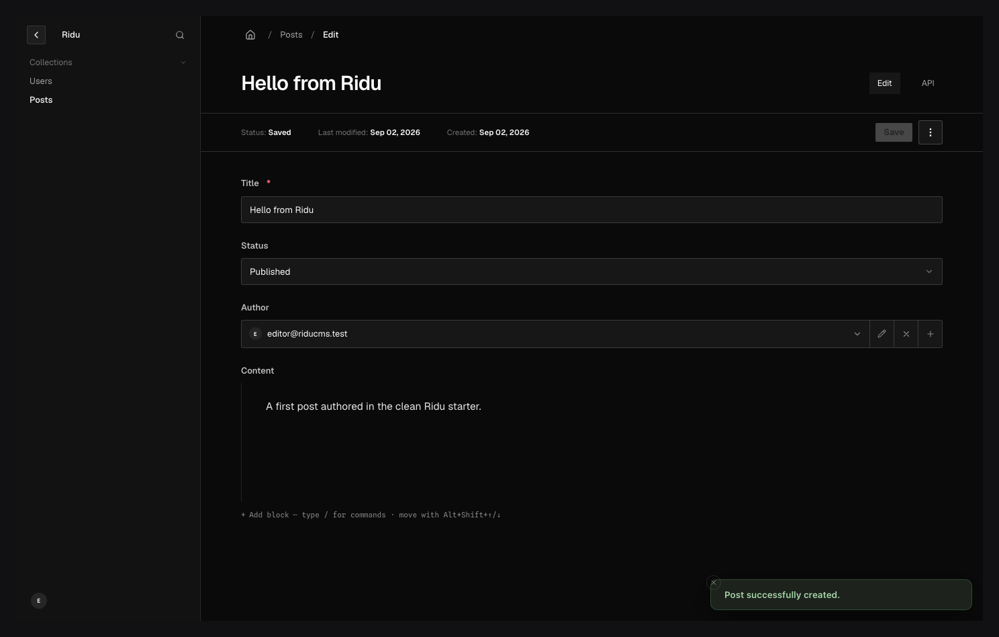

Ridu's document editor supports built-in scalar and nested fields, relationships/uploads, layout
fields, localization, joins/virtual output, and statically registered plugin fields.

## Create the first document {#create}

Open a collection and choose **Create new**. Required markers, descriptions, placeholders,
conditions, choice labels, row bounds, and field access come from resolved config. Saving applies
access, defaults, validation, hooks, persistence, and response redaction.

Server issues return to exact paths, including nested row indexes. Fix those inputs and submit
again; a rejected operation does not partially persist other fields.

## Edit safely {#edit}

The form tracks dirty values and warns before an accidental navigation. Relationships/uploads open
an access-aware browser with search, pagination, filters, selection, and permitted inline work.
Array/block rows preserve stable editing identity during reorder. A resolved schema change is
reconciled without silently submitting removed or incompatible values.

Version-aware updates carry the visible `_revision`. A competing write returns `conflict` rather
than overwriting the newer document. Refresh/review the latest state and reapply the intended change;
do not blindly replay stale input.

Available actions are capability-driven: save, save draft, publish, unpublish, duplicate,
copy-locale, delete/trash, preview, and lock takeover appear only where resource config and the
proposed document allow them. The server always rechecks the action when invoked.

## Presentation is not authorization {#access}

`ReadOnly`, `Hidden`, conditions, tabs, and plugin controls affect the editor. They cannot protect a
field from raw REST/SDK input. Use `FieldAccess` for read/create/update security and hooks/validation
for business invariants.

## If saving fails {#troubleshooting}

- Follow the field-addressed validation issue instead of editing generated contracts.
- `denied` means collection or field access rejected the current actor/context.
- `conflict` means the revision changed; reload and reconcile.
- A reference can disappear from its picker because target read access or option filters changed.
- A failed post-commit side effect must be made observable/retryable; it cannot roll back a commit
  that already succeeded.

Continue with [Drafts, versions, and scheduling](/docs/drafts-and-versions/),
[Document locks](/docs/document-locks/), [Uploads](/docs/uploads/), and
[Live preview](/guides/live-preview/).
