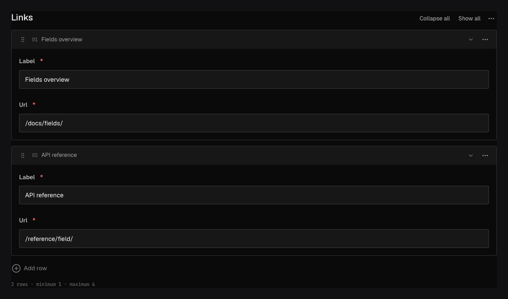

Use `field.Array` for an ordered list whose rows all have the same known shape: navigation links,
credits, opening hours, or product variants.

## In the admin {#admin-behavior}



_Rows can be reordered in the editor; the document preserves that order and one shared row shape._

## Smallest working example {#example}

```go title="content/pages.go"
field.Array(
	"links",
	field.Fields(
		field.Text("label", field.Required()),
		field.Text("url", field.Required()),
	),
	field.MinRows(1),
	field.MaxRows(12),
	field.RowLabel("label"),
)
```

```json title="document.json"
{
	"links": [{ "label": "Documentation", "url": "/docs/" }]
}
```

At least one child definition is required. `MinRows` may be zero, `MaxRows` must be at least one,
and the minimum cannot exceed the maximum. `RowLabel` names a direct stored child used for an
accessible row heading.

## Authoring and generated contracts {#options}

Authors can add, reorder, duplicate, and remove rows within configured bounds. `ArrayRowLabels`
changes singular/plural interface copy. A paired `RowLabelComponent` can render richer headings,
but keep `RowLabel` as its text fallback and remember that a component changes presentation only.

Generated types preserve the ordered row array. Validation issues include concrete indexes such as
`links.2.url`. Nested queries use canonical paths such as `links.label`; the array container supports
`exists`.

Localize a child for per-row localized values or the Array container when each locale owns an
independent list and ordering. Container localization prevents descendant locale mixing.

## Common mistakes {#troubleshooting}

- Use [Blocks](/docs/fields/blocks/) for a list of different row types.
- Row order is data. Reordering can be meaningful even when every child value stays the same.
- `RowLabel` must point to a direct stored child, not a nested path or presentation field.
- An array can grow request and document size quickly; set a realistic `MaxRows`.

See [`field.Array`](/reference/field/array/), [`field.MinRows`](/reference/field/min-rows/), and
[`field.RowLabel`](/reference/field/row-label/).
