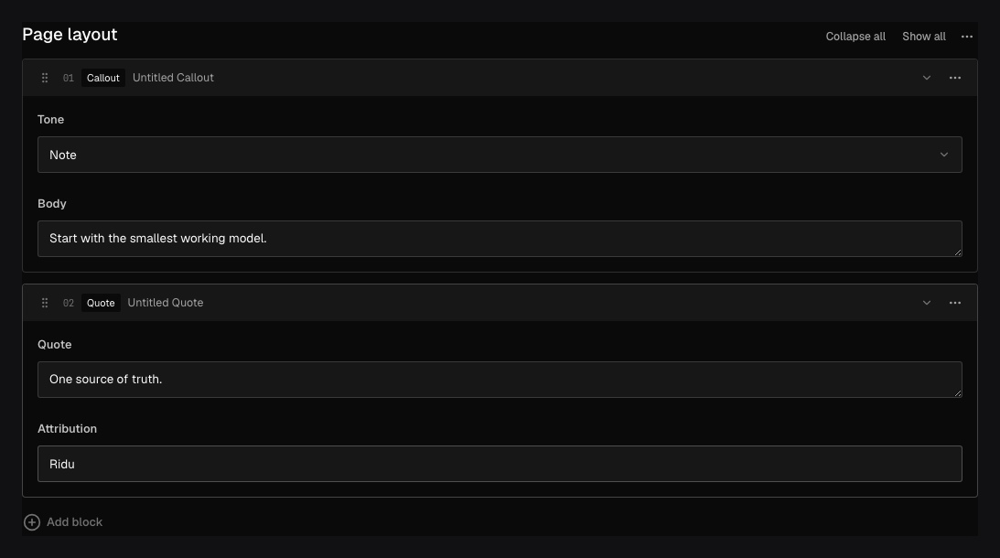

Use `field.Blocks` when authors need to combine different kinds of content in one list. A page
can contain a hero, a quote, and an image gallery in any order. Each block stores a `blockType`
value that identifies its type, followed by that type’s fields.

## In the admin {#admin-behavior}



_Authors choose a block type, fill in its fields, and drag blocks into order._

## Add blocks to a page {#example}

```go title="content/pages.go"
field.Blocks("layout",
	field.Block{
		Slug:  "hero",
		Admin: field.BlockAdmin{RowLabelPath: "heading"},
		Fields: field.Fields{
			field.Text("heading").Required(),
			field.Textarea("summary"),
		},
	},
	field.Block{
		Slug: "quote",
		Fields: field.Fields{
			field.Textarea("text").Required(),
			field.Text("source"),
		},
	},
).MinRows(1).MaxRows(20)
```

```json title="create-input.json"
{
	"layout": [
		{ "blockType": "hero", "heading": "Build with Ridu" },
		{ "blockType": "quote", "text": "Content is structured data." }
	]
}
```

At least one block type is required. Slugs must be unique lowercase kebab-case. A direct block child
cannot be named `blockType` because Ridu uses it to identify the block.

## Configuration {#configuration}

| Constructor or method                            | What it controls                                                                        |
| ------------------------------------------------ | --------------------------------------------------------------------------------------- |
| `field.Blocks(name, blocks...)`                  | Creates an ordered list from block definitions owned by this field.                     |
| `field.Block{Slug, Labels, Admin, Fields}`       | Defines a case's stable slug, author-facing labels, row presentation, and child fields. |
| `.References(slugs...)`                          | Selects registered `Config.Blocks` definitions and their picker order.                  |
| `.MinRows(n)` / `.MaxRows(n)`                    | Sets inclusive bounds for the complete block list.                                      |
| `.Required()`                                    | Requires a present, non-empty list.                                                     |
| `.Localized()`                                   | Stores separate list membership, order, keys, and values for each content locale.       |
| `.Validate(...)` / `.LiveValidate(...)`          | Validates the whole list; each selected block's child rules also run.                   |
| `.EditBlocks(...)`                               | Applies a checked immutable edit to inline block definitions.                           |
| `.Access(...)`, `.Hooks(...)`, `.ReadHooks(...)` | Controls the list as a subtree during authorization and lifecycle phases.               |

## Label blocks and limit the list {#options}

Ridu generates singular and plural block names from the slug: `hero` becomes “Hero” / “Heroes”,
`people` becomes “Person” / “People”, and `hero-banner` becomes “Hero Banner” / “Hero Banners”.
The picker, row heading fallback and rich-text insert menu use the singular name. Omit labels
unless you want different wording or capitalization:

```go
field.Block{
	Slug: "promotion",
	Labels: field.BlockLabels{
		Singular:             "CTA",
		Plural:               "CTAs",
		SingularTranslations: map[string]string{"fr": "Appel à l’action"},
		PluralTranslations:   map[string]string{"fr": "Appels à l’action"},
	},
	Fields: field.Fields{field.Text("heading")},
}
```

Each omitted form is generated independently from the slug. Defaults use English inflection;
translations use the admin language and do not affect content localization. The same defaults
and overrides apply to inline blocks, registered definitions and rich text. Labels on registered
definitions are shared by every reference. Block-type labels are separate from list/container
labels and from a row heading derived from its values.

Authors can add any configured block type, edit its fields, and reorder the list. Set
`BlockAdmin.RowLabelPath` to a direct child field to use its value as the block’s heading. In the
example, a Hero block displays its `heading` value, or “Hero” when that value is blank. JSON,
Point, and MultiSelect fields cannot supply this label.

Set `Admin.RowLabel` to a [custom row label component](/docs/custom-components/row-labels/) when
you need a richer heading.

`MinRows` and `MaxRows` constrain a supplied list. An optional field may remain absent or `null`,
but a supplied empty list must satisfy `MinRows`. `Required` additionally requires a nonempty
list. Omit `MaxRows` for no configured maximum; an explicit maximum must be positive. The admin applies the same limits to adding,
duplicating, pasting and deleting rows.

## Keep block keys when updating

Ridu assigns a `_key` to each new block and nested array row when saving. Keep the key when
editing or reordering an existing row so Ridu can recognize it. Keys must be nonblank strings
and unique within their list. Invalid keys produce a validation error at that row’s `_key` path.

Changing a row’s `blockType` requires a new key. Duplicating or pasting blocks generates new
keys for the copied blocks and nested rows.

When updating a row with an existing key, omit children that should stay unchanged. This also
preserves fields hidden by access rules. Send `null` to clear a value, or remove the row from
the list to delete it. All changes still pass through validation and access checks. New rows
receive defaults and must supply their required fields.

For translated children, an omitted value stays unchanged in the selected locale. Ridu does
not copy a fallback translation into storage. Explicit values, including `null` and empty
strings, are still validated.

In the admin, reordering preserves unsaved edits and each row’s field permissions. Collapsed
blocks indicate errors inside them; click an error to reveal the field that needs attention.

## Change block definitions

If you reduce row limits, check and migrate documents that exceed the new limits. Changing a
row heading does not change stored data.

Before removing a block type, migrate documents that use it. If stored content refers to a
removed type, Ridu preserves that content but returns a recovery conflict when it cannot safely
read or update the document. Restore the block definition or migrate the affected document;
the admin cannot edit it until the conflict is resolved.

## Query and translate blocks

Query paths include the block type, for example `layout.quote.source`. Use `exists` to check
for the list itself.

Add `.Localized()` to a child for translated values in a shared layout. Add it to the Blocks
field when each locale needs its own list of blocks and ordering.

## Name reusable block types {#generated-types}

Set `TypeName` on a block when you want a predictable name in the generated Go
and TypeScript types:

```go
var Hero = field.Block{
	Slug:     "hero",
	TypeName: "Hero",
	Fields: field.Fields{
		field.Text("heading").Required(),
		field.Text("summary"),
	},
}

layout := field.Blocks("layout", Hero).Required()
```

`TypeName: "Hero"` names the generated types; the stored `blockType` remains `hero`. You
can reuse this definition across fields and collections. Blocks sharing a generated name must
have the same fields and settings, although labels and translations may differ. Without an
explicit name, Ridu derives one from the collection and field path. Conflicting names produce
a configuration error.

## Register shared definitions {#references}

Use an explicit registry when several fields should share one fixed definition:

```go
hero := field.Block{
	Slug:     "hero",
	TypeName: "Hero",
	Fields:   field.Fields{field.Text("heading").Required()},
}
config := ridu.Config{Blocks: []field.Block{hero}}
layout := field.Blocks("layout").References("hero").MaxRows(12)
body := richtext.Field("body", richtext.Config{BlockReferences: []string{"hero"}})
```

Reference order sets picker order. Each field uses either inline blocks or references. Duplicate
registrations, repeated or missing references, mixed declarations and reference cycles are errors.
Definitions can reference other registered definitions, including inside rich text. Registration
order does not matter.

Edit the central definition to change it everywhere. Resource-local field edits may inspect its
children but cannot modify them. Register a different slug for a customized variant. Requiredness,
row limits, localization and container access remain settings of each referencing field.

Registered definitions appear once in the generated schema and `/api/schema`. Without an explicit
`TypeName`, registered names derive from the slug; inline names derive from the resource and path.
The stored `blockType`, row `_key` and field persistence identities behave the same in either form.

Access callbacks still receive the current document, row, actor and locale. Ridu evaluates them for
each occurrence, and the admin uses the same document-aware capabilities as inline blocks. Sharing a
definition does not cache an access decision across documents or rows.

## Use blocks in TypeScript

Generated TypeScript includes `Hero`, `HeroInput`, and a union such as `PagesLayoutBlock` for
the complete list. Check `blockType` to get the fields for a particular block.

`_key` is optional when creating a block and always present when reading it. Use it as the key
in Svelte loops. Other output fields may be omitted by access rules or field selection.

## Create blocks in Go

Generated Go includes a struct for each block type and a list type for the field:

```go
rows := generated.PagesLayoutInput{
	&generated.HeroInput{Heading: "Hello"},
}
// Use core.NonNull(rows) for a required layout
// in the generated create input.
```

`HeroInput` writes `blockType: "hero"` automatically. The generated `HeroBlockType` constant is
available when you need that string in a query.

When reading, use a Go type switch on `*generated.Hero` to handle each block type. Unlike
TypeScript, Go does not warn if the switch misses one of the supported types.

Invalid block data returns `*generated.ContractError`. Its `Operation`, `Container`, and `Path`
identify the failure, for example `PagesLayoutInput[0].links[1].label`. Use `errors.As` to
inspect an underlying JSON error.

## Update existing blocks in Go

Start with the read layout’s `Retain()` method. It creates an update list containing each
existing block’s key, in the same order. Change only the fields you want to update:

```go
patch, err := page.Layout.Retain()
if err != nil {
	return err
}
heading := "Updated heading"
for _, row := range patch {
	if hero, ok := row.(*generated.HeroUpdate); ok {
		hero.Heading = &heading
	}
}
// Supply core.SetNonNull(patch) as Layout
// in a revision-checked PageUpdate.
```

`Retain()` does not copy child values into the update, so unrelated fields stay unchanged,
including fields hidden by access rules. The returned list uses `HeroUpdate` and the other
generated update types. They require a key and let you omit unchanged children.

Append `&generated.HeroInput{...}` to add a block. Remove an entry to delete a block, or reorder
entries to move them. New rows must supply required fields even when you provide a key yourself.
Save with a revision check to avoid overwriting another author’s changes.

Block lists contain pointers. Call `BlockKey()` to read a row’s key without a type switch.
`Retain()` returns an error for an absent layout, nil row, empty key, or duplicate key; an
explicitly empty layout returns an empty update list.

### Update an array inside a block

Arrays inside blocks follow the same pattern. For a Content block with a `links` array,
read `links, present := content.Links.Get()`, check presence, then call `links.Retain()`.
The returned `ContentLinksUpdate` contains `*ContentLinksRowUpdate` values with only their keys.
Change the desired row and assign the list to the retained Content update with `core.Set(linksPatch)`.
Untouched rows and redacted fields survive the edit. Append `&ContentLinksRowInput{...}` to add a row,
or explicitly remove/reorder entries. Nil lists and missing or duplicate keys fail; an explicit
empty array retains an empty list. Save the containing document with a revision check.

New and retained array update rows expose `RowKey()` for finding, removing or reordering
entries without first asserting their concrete type. It returns the supplied identity,
or an empty string for a nil or unkeyed row. Concrete array read rows expose the same accessor.

### Work with choices and optional values

Select and radio children generate named string types and constants for completion in Go.
For a Hero `tone` select with `light` and `dark` choices, use `core.Set(generated.HeroToneDark)`.
The engine still validates allowed values; named Go string types are not closed enums.

Nullable block output children use `*generated.BlockOptional[T]`: a nil outer pointer means
omitted, a nil `Value` means explicit null, and `Get()` returns a concrete value when present.
Required output children use pointers because reads can redact them.

| Task                              | Use                                                                                   |
| --------------------------------- | ------------------------------------------------------------------------------------- |
| Add a block                       | `HeroInput` inside `PagesLayoutInput` (or a `PagesLayoutUpdate` when editing).        |
| Render a block                    | Switch on `*Hero`; check required-field pointers and call `Get()` on nullable fields. |
| Edit a retained block             | Call `Retain()`, then edit `*HeroUpdate`.                                             |
| Supply an optional mutation value | `core.Set(value)`; use `core.Null[T]()` for explicit null.                            |
| Supply a required list            | `core.NonNull(rows)` on create; `core.SetNonNull(patch)` on update.                   |

Mutation wrappers expose `Get()` to inspect a concrete value with the same `(value, ok)`
pattern as nullable reads. A nullable wrapper reports false for omission or null; a non-null
wrapper reports false only when omitted.

A nil pointer omits the field from an update. For a field represented by `*T`, pass a pointer
to send a concrete value, including empty strings, zero and false. Keep display defaults in
your renderer; avoid copying defaulted read values into updates.

## Read and list documents with blocks in Go

The generated collection supports reads and writes:
`PagesCollection` supports `Create`, `Update`, and populated `Find` and `List` reads, while
`PagesCollectionAllLocales` selects all locales automatically for both operations.
The all-locales collection is generated when localization is configured.
Use `core.TypedListOptions` for filtering, sorting, pagination, population and projection:

```go
assetPath, err := query.ParsePath("layout.media.asset")
if err != nil {
	return err
}
result, err := generated.PagesCollection.With(app.Local()).List(ctx,
	core.TypedListOptions{
		Limit:    20,
		Populate: []query.Population{{Path: assetPath, Depth: 1}},
	})
```

For a layout with a Media block and asset relationship, `result.Documents` contains typed
pages with populated assets. Access rules apply before pagination; decode failures return
an error with no partial page. Use `PagesCollectionAllLocales.With(app.Local()).List`
when exporting translations. Populated references expose an ID and an optional typed document.
`AllLocalesValue` types describe values beneath a localized container: their children are
already locale-specific, but populated targets may still contain locale maps.

The repository’s `examples/blocks` application shows pages built from Hero, Content, Media,
and CTA blocks, including reused blocks, related assets, and blocks inside rich text. It
includes creation and rendering examples in Go, TypeScript, and Svelte. For file uploads, see
[Uploads](/docs/uploads/).

## Common mistakes {#troubleshooting}

- The block type’s `Key` is stored as `blockType`. Renaming or removing a type requires migrating
  existing data and updating code that reads those blocks.
- Use [Array](/docs/fields/array/) when every row has the same shape; it keeps the list simpler.
- Blocks store structured content. Handle every generated union member in the frontend.

See [`field.Blocks`](/reference/field/blocks/), [`field.Block`](/reference/field/block/), and
[Generated contracts](/docs/generated-contracts/).
