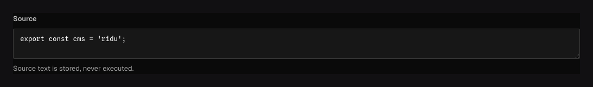

Use `field.Code` for source text, templates, queries, or configuration where syntax-aware authoring
is useful. It stores a string; Ridu does not execute, compile, or trust the value.

## In the admin {#admin-behavior}



_Language changes highlighting only; stored source remains an unexecuted string._

## Smallest working example {#example}

```go title="content/snippets.go"
field.Code("source", field.Language("typescript"), field.Required())
```

`Language` is an editor hint. It does not validate that the source parses and does not transform
the returned string.

## Options and constraints {#options}

Code accepts string length constraints, a string default, localization, indexing/uniqueness, and
the common admin options. Only Code accepts `field.Language`; applying it to Text or Textarea is a
configuration error reported by `ridu.Resolve`.

```go title="content/templates.go"
field.Code(
	"template",
	field.Language("html"),
	field.MaxLength(50_000),
	field.Description("Rendered by the application after its own validation."),
)
```

Queries use the string operators. Localization can be useful for locale-specific
templates, but be explicit about fallback behavior when a missing translation would change
execution or presentation.

## Security and troubleshooting {#troubleshooting}

- Treat code values as untrusted content. Never pass them to `eval`, a shell, a template engine, or
  a database without an application-owned parser, allowlist, and resource bounds.
- Syntax highlighting is not syntax validation. Add a hook or plugin validator when valid source
  is a business requirement.
- Use [JSON](/docs/fields/json/) when machines need structured configuration rather than source
  text, and Rich text when authors need formatted prose.

See [`field.Code`](/reference/field/code/) and [`field.Language`](/reference/field/language/).
