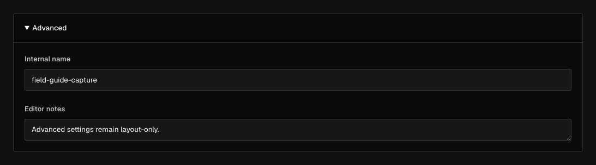

Use `field.Collapsible` to keep optional or advanced controls available without making the default
editor overwhelming. It changes presentation only; children stay at their current document path.

## In the admin {#admin-behavior}



_Collapsing changes only presentation; child values remain at their existing document paths._

## Smallest working example {#example}

```go title="content/pages.go"
field.Collapsible(
	"advancedSettings",
	true,
	field.Text("canonicalURL", field.Label("Canonical URL")),
	field.JSON("providerMetadata"),
)
```

The second argument controls whether the disclosure starts collapsed. The document has root
`canonicalURL` and `providerMetadata` properties; there is no `advancedSettings` object.

Child fields retain their own labels, descriptions, validation, access, conditions, and generated
contracts. Opening or closing the disclosure never changes submitted values.

## When to use it {#when-to-use}

Collapsibles work well for infrequent metadata and power-user settings. Do not put required fields
or the primary task behind a closed disclosure without a clear error path—the author should be able
to find and correct validation issues.

Use [Group](/docs/fields/group/) when children need a stored object boundary, and
[Tabs](/docs/fields/tabs/) when a long form needs peer sections rather than optional detail.

## Common mistakes {#troubleshooting}

- Collapsed is not hidden. Values are still read, submitted, validated, and authorized.
- Moving existing fields into a Collapsible is presentation-only; changing their names or nesting
  is a migration.
- Keep the label meaningful to screen-reader and keyboard users; do not rely on an icon alone.

See [`field.Collapsible`](/reference/field/collapsible/) and [Admin field layout](/docs/admin/#field-layout).
