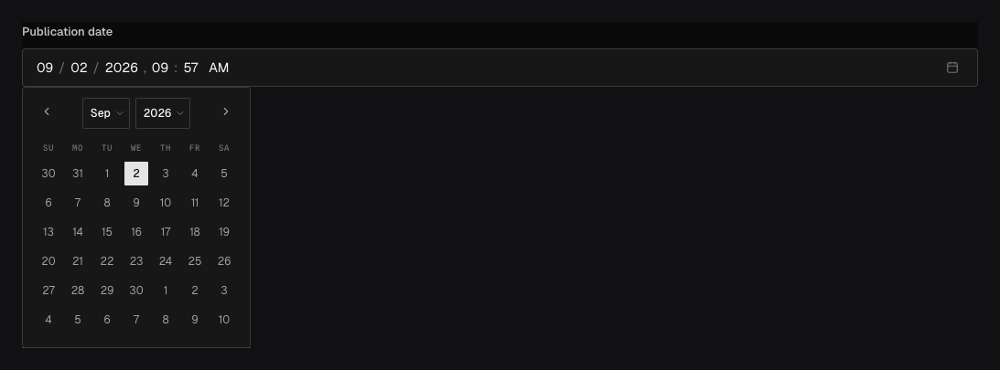

Use `field.Date` for a calendar day, wall-clock time, or absolute timestamp. Date values remain
strings on the wire so their format and timezone meaning stay explicit.

## In the admin {#admin-behavior}



_Picker appearance also selects the wire format; this day-and-time value is stored as an RFC 3339 timestamp._

## Choose the value shape {#example}

```go title="content/events.go"
field.Date(
	"startsAt",
	field.Required(),
	field.PickerAppearance(field.DatePickerDayAndTime),
)
```

| Appearance             | Accepted value        | Use it for                                        |
| ---------------------- | --------------------- | ------------------------------------------------- |
| `DatePickerDayOnly`    | `YYYY-MM-DD`          | Birthdays, release days, and other calendar dates |
| `DatePickerDayAndTime` | RFC 3339 timestamp    | An instant such as `2027-06-10T09:30:00Z`         |
| `DatePickerTimeOnly`   | `HH:mm` or `HH:mm:ss` | A local opening time without a date               |

The selected appearance controls both server validation and the admin control. Omitting it uses the
default; set it when consumers depend on one shape.

## Options, querying, and localization {#options}

Date supports `Required`, string defaults, localization, uniqueness/indexing, and common admin
options. Filters and sorts compare normalized accepted date strings. Use RFC 3339 with an explicit
offset for day-and-time values; convert for display in the consumer rather than removing timezone
information before storage.

A localized date is appropriate only when the underlying content really differs by locale. A
single event instant usually should not be localized merely because each audience formats it
differently.

## Common mistakes {#troubleshooting}

- Do not send a JavaScript `Date` object directly. Serialize a day/time string matching the chosen
  appearance.
- A day-only value has no timezone. Do not convert it through midnight UTC and accidentally move it
  to another day.
- Time-only values need an application-owned timezone and recurrence model if they represent store
  hours or schedules.

See [`field.Date`](/reference/field/date/),
[`field.PickerAppearance`](/reference/field/picker-appearance/), and [querying](/docs/querying/).
