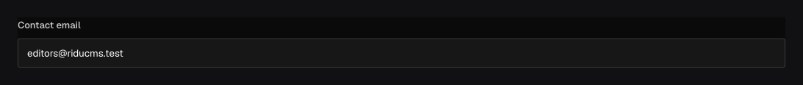

Use `field.Email` to store an email address as a string. The admin shows an email input, and the
server checks the address format when saving.

## In the admin {#admin-behavior}



_The admin and API both check the email address format._

## Add an email address {#example}

```go title="content/contacts.go"
field.Email("contactEmail").Required()
```

The same validation runs when you save through the admin, REST, the SDK, or the Local API. Invalid input produces a `422 validation` response with an issue at `contactEmail`.

## Configuration {#configuration}

| Constructor or method                                           | What it controls                                                            |
| --------------------------------------------------------------- | --------------------------------------------------------------------------- |
| `field.Email(name)`                                             | Creates a stored string field with built-in email-format validation.        |
| `.Required()`                                                   | Rejects a missing, null, or empty address.                                  |
| `.Unique()` / `.Index()`                                        | Enforces a distinct address or adds a query index.                          |
| `.Default(value)` / `.DefaultFrom(callback)`                    | Supplies an initial address for an omitted new field.                       |
| `.Localized()`                                                  | Stores a separate address for each content locale when that is intentional. |
| `.Validate(callback)` / `.LiveValidate(callback)`               | Adds application-specific save or live checks after format validation.      |
| `.Admin(...)`, `.Access(...)`, `.Hooks(...)`, `.ReadHooks(...)` | Configures presentation, authorization, write hooks, and response hooks.    |

## Require a unique address {#options}

```go title="content/teams.go"
field.Email("billingEmail").
	Required().
	Unique().
	Admin(field.Admin{
		Description: "Invoices and payment notices are sent here.",
	})
```

Email supports common string-field presentation, default, localization, uniqueness, and indexing
options. Use `Unique` when one address must identify at most one document in that collection. An
email field does not send mail, verify ownership, or make a collection authenticate users; those
are separate application and [authentication](/docs/authentication/) concerns.

Email values can be selected, sorted, and filtered like other text fields. A localized
email is valid when each locale needs a different address; translating the label uses
`LabelTranslations` instead.

## Common mistakes {#troubleshooting}

- Syntactic validation does not confirm that an inbox exists or belongs to the person submitting it. Use a
  verification workflow for that claim.
- Normalize addresses according to your product policy before relying on uniqueness. Ridu does not
  invent provider-specific equivalence rules such as stripping dots or `+` suffixes.
- A collection with an `email` field is not automatically an auth collection. Set `Auth: true` and
  configure its access and account workflows.

See [`field.Email`](/reference/field/email/) and [Authentication](/docs/authentication/).
