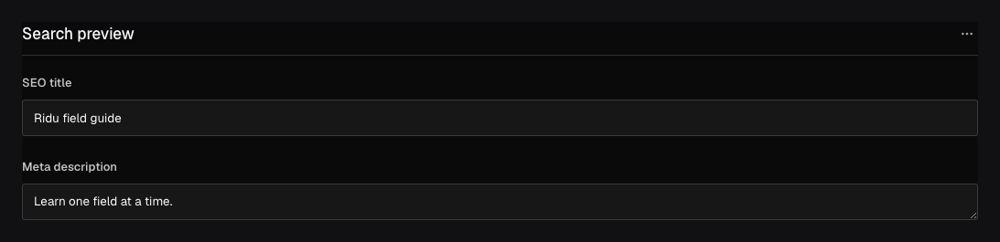

Use `field.Group` for one object with a known shape: SEO metadata, an address, dimensions, or a
reusable set of settings. Generated Go and TypeScript types include the nested fields.

## In the admin {#admin-behavior}



_Grouped controls become one nested object, with child paths such as `seo.title`._

## Group related fields {#example}

```go title="content/posts.go"
field.Group("seo", field.Fields{
	field.Text("title").MaxLength(60),
	field.Textarea("description").MaxLength(160),
})
```

```json title="document.json"
{
	"seo": {
		"title": "A concise search title",
		"description": "A concise search description."
	}
}
```

At least one child field is required. Child names must be unique within the group and produce
paths such as `seo.title` and `seo.description`.

## Configuration {#configuration}

| Constructor or method                            | What it controls                                                                                   |
| ------------------------------------------------ | -------------------------------------------------------------------------------------------------- |
| `field.Group(name, fields)`                      | Creates one stored object with the supplied child fields.                                          |
| `.Required()`                                    | Requires the group object; child requiredness remains separate.                                    |
| `.Localized()`                                   | Stores a separate object for each content locale; localized children can also opt in individually. |
| `.Validate(...)` / `.LiveValidate(...)`          | Validates the complete object; child validators still run.                                         |
| `.EditChildren(...)`                             | Applies a checked immutable edit to the group's direct child graph.                                |
| `.Admin(...)`                                    | Sets label, description, width, visibility, and collapsed presentation.                            |
| `.Access(...)`, `.Hooks(...)`, `.AfterRead(...)` | Controls the group as a subtree during authorization and lifecycle phases.                         |

## Customize a reusable group {#reusable-groups}

Define a function that returns a group, then use `field.EditChild` to change one child where the
group is used. Here, `CompactLink` limits the label length without repeating the Link definition:

```go
func Link(name string) field.GroupField {
	return field.Group(name, field.Fields{
		field.Text("label").Required(),
		field.Text("href").Required(),
	})
}

func CompactLink(name string) (field.GroupField, error) {
	return field.EditChild(Link(name), "label", field.AsText,
		func(label field.TextField) field.TextField {
			return label.MaxLength(32).EditAdmin(func(admin *field.Admin) {
				admin.Description = "Keep navigation labels short"
			})
		})
}
```

`field.AsText` checks that `label` is a Text field before calling your function. Use
`field.AsCheckbox`, `field.AsRelationship`, or the matching converter for another field type.
The edit keeps existing settings and changes only the values you set.

| Helper                                              | What it does                                |
| --------------------------------------------------- | ------------------------------------------- |
| `field.EditChild(parent, name, field.AsText, edit)` | Change a child field or its admin settings. |
| `field.ReplaceChild(parent, name, replacement)`     | Replace a child and all its settings.       |
| `field.AppendChild(parent, child)`                  | Add a child after the existing fields.      |

These functions also work on arrays. They return an updated field and leave the original
definition unchanged. An unknown child name, wrong field type, or invalid edit returns an error.
Use the child’s direct name, such as `label`; dotted paths are not accepted. `ReplaceChild`
replaces the entire field, including its validation and access rules.

Use `EditChildren` with `field.ChildrenDraft` when you need to change several children together
or rename a child and update references to it.

## Query and translate nested fields {#options}

Group supports `Required`, `Localized`, conditions, and common presentation options. Each child
keeps its own validation, access rules, hooks, and admin settings. Query nested children with
a dotted path such as `seo.title`; the generated SDK accepts these paths in `where`. The group
container also supports an `exists` filter.

Localize individual children when only those values vary. Put `Localized` on the Group when the
entire object varies by locale. A localized container falls back as a container instead
of mixing child values from different locale objects.

## Common mistakes {#troubleshooting}

- Use [Array](/docs/fields/array/) when there can be several objects and [Blocks](/docs/fields/blocks/)
  when rows have different shapes.
- A Group changes the API path. Use [Row](/docs/fields/row/) or [Collapsible](/docs/fields/collapsible/)
  to organise controls without adding an object wrapper.
- Renaming the group or a child is a stored-data and API migration.

See [`field.Group`](/reference/field/group/) and [`field.Fields`](/reference/field/fields/).
