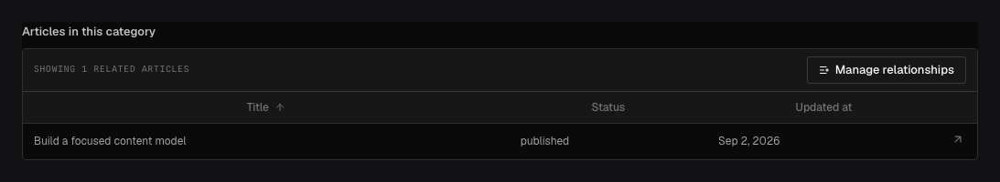

Use `field.Join` to show documents that link to the document being read. For example, a category
can list all posts whose `category` relationship points to it. Ridu finds these posts when you
read the category, so you do not have to maintain a second list of IDs.

## In the admin {#admin-behavior}



_The category shows the posts that currently link to it._

## List the posts in a category {#example}

```go title="content/categories.go"
var Categories = ridu.Collection{
	Slug: "categories",
	Fields: field.Fields{
		field.Text("name").Required(),
		field.Join("posts", "posts", "category"),
	},
}

var Posts = ridu.Collection{
	Slug: "posts",
	Fields: field.Fields{
		field.Text("title").Required(),
		field.Relationship("category", "categories"),
	},
}
```

The three arguments are the field name to return (`posts`), the collection to search (`posts`),
and the relationship to follow (`category`). That relationship must point to one document in the
current collection; relationships to several documents or collection types are not supported.

## Configuration {#configuration}

| Constructor or method                   | What it controls                                                                    |
| --------------------------------------- | ----------------------------------------------------------------------------------- |
| `field.Join(name, collection, on)`      | Finds target documents whose `on` relationship points back to the current document. |
| `.Limit(n)`                             | Bounds rows returned and shown for this join.                                       |
| `.DefaultColumns(paths...)`             | Chooses the target fields shown in the admin table.                                 |
| `.DefaultSort(path)`                    | Sets the initial target sort; prefix the path with `-` for descending order.        |
| `.AllowCreate(true)`                    | Lets an author create and link a target document from the join UI.                  |
| `.Access(...)` / `.RestrictAccess(...)` | Controls whether the computed join appears in a response.                           |
| `.AfterRead(...)`                       | Transforms the returned join output without adding stored data.                     |

Join is computed from the target relationship. It has no default, requiredness, write hook, or
stored column on the current document.

## Configure the admin view {#options}

```go title="content/categories.go"
field.Join("posts", "posts", "category").
	Limit(20).
	DefaultColumns("title", "status", "updatedAt").
	DefaultSort("-updatedAt").
	AllowCreate(true)
```

`Limit` accepts 1 through 100. Use `DefaultColumns` and `DefaultSort` to configure the table,
and `AllowCreate` to let authors create a related document from it. Authors still need read or
create access to the target collection. Joins must live at a collection root
and are not supported on globals.

The value appears in generated output but never in create/update input. Reads apply target access,
hooks, localization, and field redaction. Select output fields to omit an expensive join when a
consumer does not need it. Use SDK `mutateJoin` for an explicit atomic addition/removal; it updates
the target documents' forward relationships through validation and access.

## Common mistakes {#troubleshooting}

- Do not create and manually synchronize a second forward relationship.
- `AllowCreate(true)` shows a create button; it does not grant create permission.
- Changing the collection or relationship path changes which documents the Join returns.

See [`field.Join`](/reference/field/join/) and [Relationships and joins](/docs/relationships/#inverse-join).
