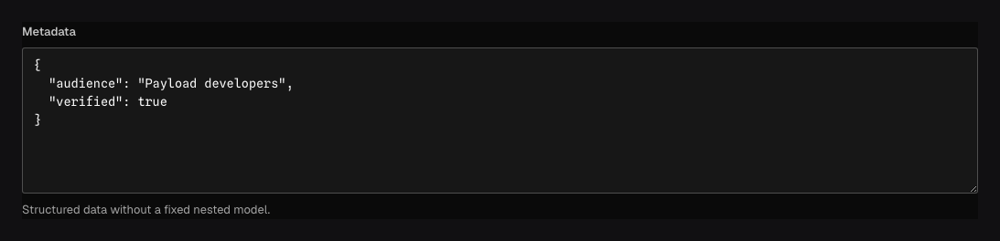

Use `field.JSON` for JSON-compatible data whose shape is genuinely open or controlled by another
system. It accepts null, booleans, finite numbers, strings, arrays, and objects and generates
`unknown` in TypeScript so consumers must narrow the value before use.

## In the admin {#admin-behavior}



_Authors edit open JSON; generated TypeScript exposes `unknown`, requiring consumers to narrow it._

## Smallest working example {#example}

```go title="content/integrations.go"
field.JSON(
	"providerMetadata",
	field.Description("Opaque metadata returned by the connected provider."),
)
```

The admin provides a JSON authoring control and the operation engine rejects malformed/non-JSON
values from every transport.

## When to model the shape instead {#model-the-shape}

Prefer [Group](/docs/fields/group/) when the object has known properties, [Array](/docs/fields/array/)
for repeated known rows, or [Blocks](/docs/fields/blocks/) for an authored union. Explicit fields
produce better validation, migrations, generated types, filters, access paths, and admin controls.

JSON supports `Required`, `Localized`, conditions, and common presentation options. It
does not accept scalar `Default`, length, numeric, choice, or relationship options. Define a plugin
field when an open-looking value still needs a reusable validator and generated type.

## Querying and localization {#querying}

Select or omit the JSON property as one value. The query API does not support JSON path operators.
Promote fields you must filter or sort into the content model.

`Localized` stores the whole JSON value independently per locale. Partial locale fallback applies
to the field value, not recursively to individual object keys.

## Common mistakes {#troubleshooting}

- Do not use JSON to avoid modelling a stable business object; consumers then lose generated
  contracts and path-aware validation.
- JSON does not accept functions, `undefined`, `Date`, `Map`, circular values, `NaN`, or infinity.
- Treat provider metadata as untrusted input even after JSON decoding.

See [`field.JSON`](/reference/field/json/) and [Generated contracts](/docs/generated-contracts/).
