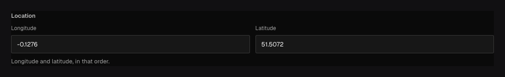

Use `field.Point` for one geographic coordinate. The stored value is a two-number array in
**longitude, latitude** order: `[longitude, latitude]`.

## In the admin {#admin-behavior}



_Separate inputs write a `[longitude, latitude]` tuple; coordinate order is part of the API._

## Add a location {#example}

```go title="content/venues.go"
field.Point("location").
	Required().
	Admin(field.Admin{
		Description: "Enter the venue's longitude and latitude.",
	})
```

```json title="document.json"
{
	"location": [-0.1276, 51.5072]
}
```

Longitude must be finite and between `-180` and `180`; latitude must be finite and between `-90`
and `90`. Ridu rejects an array with the wrong length, reversed object-shaped coordinates, numeric
strings, `NaN`, or infinities.

## Configuration {#configuration}

| Constructor or method                             | What it controls                                               |
| ------------------------------------------------- | -------------------------------------------------------------- |
| `field.Point(name)`                               | Creates one stored `[longitude, latitude]` tuple.              |
| `.Required()`                                     | Requires a valid point instead of null or omission.            |
| `.Localized()`                                    | Stores a separate point for each configured content locale.    |
| `.Validate(callback)` / `.LiveValidate(callback)` | Adds save or live rules beyond the built-in coordinate bounds. |
| `.Admin(...)`                                     | Sets label, description, width, and conditional visibility.    |
| `.Access(...)` / `.RestrictAccess(...)`           | Replaces or narrows field create/read/update access.           |
| `.Hooks(...)` / `.ReadHooks(...)`                 | Changes the stored value lifecycle or response.                |

## Validation and location searches {#options}

Point supports `Required`, `Localized`, conditions, descriptions, labels, layout options, and a
custom admin component from a plugin. It does not accept numeric `Min`, `Max`, or `Step`: coordinate bounds
are fixed by the coordinate system.

Select the point as one property. The Ridu query API does not expose raw PostGIS or MongoDB driver
handles. Add an indexed search integration for radius, polygon, or route queries.

Localization stores a separate coordinate pair per locale. This is unusual but useful when the
content itself represents locale-specific offices; presentation formatting alone does not require
localization.

## Common mistakes {#troubleshooting}

- The order is longitude first. `[51.5072, -0.1276]` points somewhere else.
- A Point is not a postal address, accuracy reading, or geometry collection. Model those as sibling
  fields or a Group.
- Validate whether `0,0` is meaningful to your application; it is geographically valid and Ridu
  will not treat it as missing.

See [`field.Point`](/reference/field/point/) and [custom fields](/guides/custom-fields/).
