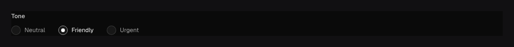

Use `field.Radio` for a small set of mutually exclusive choices that authors should see without
opening a dropdown. It stores one configured string value, just like
[Select](/docs/fields/select/).

## In the admin {#admin-behavior}



_Labels remain interface copy; the document stores one configured option value._

## Add radio buttons {#example}

```go title="content/posts.go"
field.Radio("priority", "low", "normal", "high").Default("normal")
```

Strings receive generated labels. Use `.Options(...)` to replace the list with typed options
when the text shown to authors should differ from the stored value:

```go title="content/events.go"
field.Radio("attendance").Options(
	field.Option{Value: "remote", Label: "Join online"},
	field.Option{Value: "venue", Label: "Attend at the venue"},
).Required()
```

Radio supports a string `Default`, `Required`, localization, indexing/uniqueness, conditions, and
common presentation options. Its value is always one string; use MultiSelect
for multiple values.

Queries and generated types use stored values, never labels. Option labels may be translated
for the admin without localizing the content value. Add `.Localized()` only when different
locales may select different business values.

## Configuration {#configuration}

| Constructor or method                                                 | What it controls                                                                  |
| --------------------------------------------------------------------- | --------------------------------------------------------------------------------- |
| `field.Radio(name, values...)`                                        | Creates one stored string choice with labels inferred from the values.            |
| `.Options(options...)`                                                | Replaces the options with `field.Option` values and explicit labels/translations. |
| `.Required()`                                                         | Requires one configured choice.                                                   |
| `.Default(value)` / `.DefaultFrom(callback)`                          | Selects a fixed or request-aware initial choice.                                  |
| `.Localized()`                                                        | Stores a separate selected value for each content locale.                         |
| `.Unique()` / `.Index()`                                              | Enforces distinct values or adds a query index.                                   |
| `.Validate(...)`, `.LiveValidate(...)`, `.Access(...)`, `.Hooks(...)` | Adds application checks, authorization, and lifecycle behavior.                   |

## Common mistakes {#troubleshooting}

- Too many radio choices create a slow form. Switch to Select or a Relationship picker as the set
  grows.
- Renaming `Option.Value` is a data migration. Changing `Label` is safe presentation copy.
- `Admin.VisibleWhen` can improve the form but cannot enforce a cross-field rule or access policy.

See [`field.Radio`](/reference/field/radio/) and [Select](/docs/fields/select/) for more choice options.
