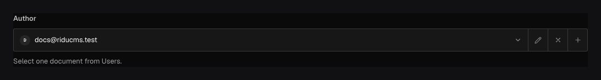

Use `field.Relationship` when one document refers to another. Ridu validates target existence and
read access at write time, stores stable references, and can populate authorized target documents
in read responses.

## In the admin {#admin-behavior}



_The picker shows the target label; stored data contains a reference that can be populated on read._

## One target or many {#example}

```go title="content/posts.go"
field.Relationship(
	"author",
	field.To("users"),
	field.Required(),
	field.OnDelete(field.ReferenceDeleteRestrict),
)
```

A singular relationship to one collection stores its document ID. Use `ToMany("users")` for an
ordered list. Use `ToAny("posts", "media")` for a polymorphic relationship; its wire value carries
both `relationTo` and `id`, so equal IDs in different collections are unambiguous. Add `HasMany()`
for a polymorphic list.

## Narrow the author picker {#option-filters}

```go title="content/posts.go"
field.Relationship(
	"reviewer",
	field.To("users"),
	field.FilterOptionRules(
		field.OptionFilter("team", field.FilterEquals, "editorialTeam"),
	),
)
```

Option filters drive the admin picker **and** are revalidated on the server. They are not access
rules: a candidate must pass target read access and every configured predicate. Static rules use
`OptionFilterValue`; polymorphic rules can use `OptionFilterFor`.

## Deletion, querying, and localization {#behavior}

`ReferenceDeleteNullify` clears an optional singular value or removes list members when the target
is permanently deleted. `ReferenceDeleteRestrict` blocks that deletion while a current reference
exists. Required references always restrict. Version snapshots remain immutable.

Filter by IDs/reference shapes, select the stored reference, or request bounded `populate` through
the Local API/SDK. Population reapplies target access, field redaction, localization, and depth
limits. `Localized` stores an independent reference per content locale.

## Common mistakes {#troubleshooting}

- The target collection must be declared, and upload-only semantics belong in [Upload](/docs/fields/upload/).
- Changing singular/many shape or removing a target is a destructive data-contract migration.
- Picker visibility never replaces authorization.
- Use [Join](/docs/fields/join/) for the inverse view; do not duplicate both sides as manually
  synchronized ID lists.

See [`field.Relationship`](/reference/field/relationship/) and the complete
[relationship and population guide](/docs/relationships/).
