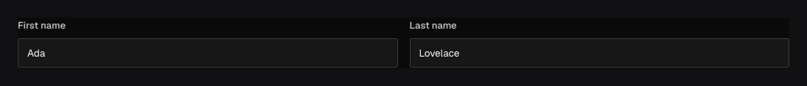

Use `field.Row` to place related fields side by side. It changes the admin layout without adding
a nested object to the document.

## In the admin {#admin-behavior}



_The controls share a responsive row but remain top-level properties in JSON._

## Place two fields side by side {#example}

```go title="content/people.go"
field.Row(field.Fields{
	field.Text("firstName").Admin(field.Admin{Columns: 6}),
	field.Text("lastName").Admin(field.Admin{Columns: 6}),
})
```

The document shape is `{ firstName, lastName }`, not `{ row: { … } }`. `Columns` accepts values from
1 through 12. On narrow screens the admin preserves readable controls instead of forcing an
unusable desktop grid.

## Configuration {#configuration}

| Constructor or method                     | What it controls                                                                             |
| ----------------------------------------- | -------------------------------------------------------------------------------------------- |
| `field.Row(fields)`                       | Places child controls in one responsive row without adding a data path.                      |
| Child `Admin.Columns`                     | Gives a child 1–12 columns of the desktop row.                                               |
| Child field methods                       | Keep each child's requiredness, access, validation, hooks, and storage at its existing path. |
| `.Admin(...)` / `.EditAdmin(...)`         | Sets or edits presentation metadata for the layout node.                                     |
| `.Label(...)` / `.LabelTranslations(...)` | Supplies author-facing layout copy when a surrounding surface displays it.                   |

Row is a layout field, so it has no `.Required()`, `.Localized()`, access rule, validator, or
stored value of its own.

## When to use Row {#when-to-use}

Rows are useful for short fields that authors understand together: first/last name, latitude and
longitude labels, or a status beside a date. Keep long text, rich text, arrays, and other dense
controls full width so authors have room to work.

Each child keeps its own validation, hooks, access rules, conditions, localization, and generated
type. Query the child by its normal path. A Row can appear within a tab or other supported
layout, but it should not be mistaken for a stored nested container.

## Common mistakes {#troubleshooting}

- Column totals do not create server validation. They only describe layout.
- Use [Group](/docs/fields/group/) when the API should contain a nested object.
- Changing Row layout does not require a data migration; renaming or moving its child fields does.
- Do not hide an authorization-sensitive field by squeezing it out of the layout—use field access.

See [`field.Row`](/reference/field/row/) and [`field.Admin.Columns`](/reference/field/admin/).
