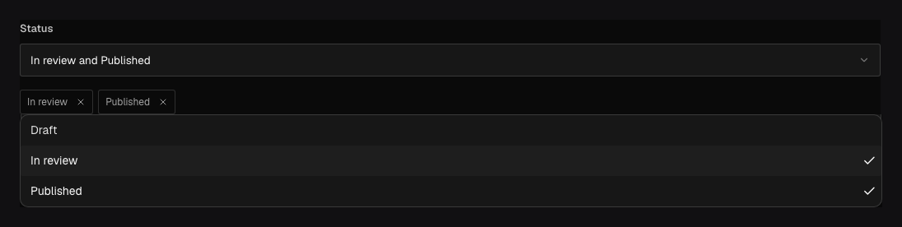

Use `field.Select` when a value must come from a finite set. It renders a dropdown for one choice
and a multi-select when you add `field.Multiple()`. Generated TypeScript narrows input and output to
the configured string values instead of a free-form `string`.

## In the admin {#admin-behavior}



_The menu displays labels; stored and generated values use the configured choice keys._

## Smallest working example {#example}

```go title="content/posts.go"
field.Select(
	"status",
	field.OneOf("draft", "review", "published"),
	field.Default("draft"),
)
```

`OneOf` derives labels from the stored values. Use `Choices` when author-facing labels should differ:

```go title="content/posts.go"
field.Select(
	"visibility",
	field.Choices(
		field.Choice{Value: "public", Label: "Everyone"},
		field.Choice{Value: "members", Label: "Signed-in members"},
	),
)
```

Values are stable data; labels and `LabelTranslations` are presentation. Changing `members` to
`registered` is a data/API migration, while changing its label is not.

## Multiple choices {#multiple}

```go title="content/posts.go"
field.Select(
	"channels",
	field.OneOf("web", "email", "social"),
	field.Multiple(),
	field.DefaultChoices("web", "email"),
)
```

Multi-selects store an ordered list of unique configured values. Use `DefaultChoices` rather than
the scalar `Default`. `Radio` cannot be multiple.

## Validation, queries, and localization {#options}

At least one non-empty unique choice is required. Defaults must be in the choice list. Select also
supports `Required`, localization, indexing/uniqueness where appropriate, conditions, and common
admin options. Query single choices with scalar equality/inequality and multi-selects with the
generated list-aware operators. Localizing the field stores different selected values per content
locale; translating choice labels alone uses `Choice.WithLabelTranslations`.

## Common mistakes {#troubleshooting}

- Do not use labels as API values. Submit the exact `Value` string.
- Adding a choice is additive; removing or renaming a value requires a migration for existing data.
- Use [Relationship](/docs/fields/relationship/) when choices are managed documents rather than a
  fixed list compiled into config.

See [`field.Select`](/reference/field/select/), [`field.Choices`](/reference/field/choices/), and
[`field.Multiple`](/reference/field/multiple/).
