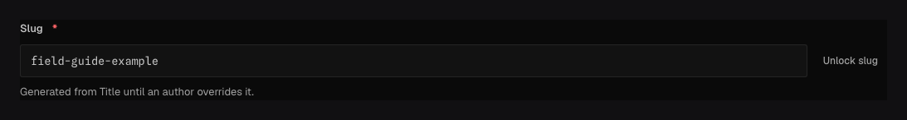

Use `field.Slug` for a URL-safe identifier derived from another string field. It uses text
storage and generated `string` contracts, but is always required, collection-wide unique, and
indexed.

## In the admin {#admin-behavior}



_The value follows source edits until an author overrides it; **Generate slug** restores source-driven updates._

## Smallest working example {#example}

```go title="content/posts.go"
field.Text("title", field.Required()),
field.Slug("slug", "title"),
```

When `slug` is omitted on create, Ridu derives it from `title`. Generated slugs follow later source
edits. Once an author submits a different slug, that manual value remains stable. The
admin's **Generate slug** action returns it to source-derived behavior.

The source can be a direct string or a string beneath non-repeated groups, for example
`seo.pageTitle`. It cannot traverse an array or blocks list.

## Normalization contract {#normalization}

Ridu applies the same fixed normalization in the server and admin: ASCII letters become lowercase,
digits and underscores remain, whitespace and hyphen runs become one hyphen, and other characters
are removed. Requests that bypass the admin are normalized too. Use `field.NormalizeSlug` when
application code needs the same result.

```go title="slug_test.go"
got := field.NormalizeSlug("  Hello, Ridu!  ")
// got == "hello-ridu"
```

## Constraints and migrations {#constraints}

Slug fields cannot declare a default or `Localized`. Their source chain cannot be localized either.
For locale-specific URLs, model separate explicit fields and routing rules. Labels, descriptions,
conditions, and compatible string presentation options still work.

A slug rename can break inbound URLs even when the database migration succeeds. Preserve redirects
in the consuming application and decide whether old values must remain reserved.

## Common mistakes {#troubleshooting}

- Do not duplicate `Required`, `Unique`, or `Index`; `Slug` already owns those guarantees.
- Empty normalization (for example a title containing only removed characters) is invalid; require
  a usable source or let the author enter a manual value.
- Do not expect Unicode transliteration. Normalization is ASCII and deterministic.

See [`field.Slug`](/reference/field/slug/) and
[`field.NormalizeSlug`](/reference/field/normalize-slug/).
