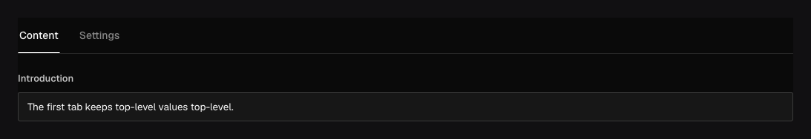

Use `field.Tabs` to divide a long editor into focused sections. A **named** tab stores its children
under an object property; an **unnamed** tab changes only the admin layout and leaves child paths at
their current level.

## In the admin {#admin-behavior}



_Tabs separate the form into sections. Named tabs also group their values in a nested object._

## Named and unnamed tabs {#example}

```go title="content/pages.go"
field.Tabs(field.Fields{
	field.UnnamedTab("Content", field.Fields{
		field.Text("title").Required(),
		field.Textarea("body"),
	}),
	field.NamedTab("seo", "Search & sharing", field.Fields{
		field.Text("title").MaxLength(60),
		field.Textarea("description").MaxLength(160),
	}),
})
```

The resulting document has root `title` and `body` properties plus a nested `seo` object. Choose
named tabs when you want those fields in a nested object. Use unnamed tabs to organize the
form while keeping the document structure unchanged.

Translate tab labels with `LabelTranslations`. To store translated content, add `.Localized()`
to the child fields or the container whose values vary by locale.

## Configuration {#configuration}

| Constructor                           | Stored shape and options                                                                                                      |
| ------------------------------------- | ----------------------------------------------------------------------------------------------------------------------------- |
| `field.Tabs(tabs)`                    | Creates the tab set; its children must be `NamedTab` or `UnnamedTab` definitions.                                             |
| `field.UnnamedTab(label, fields)`     | Adds a presentation-only tab. Children stay at their current data paths.                                                      |
| `field.NamedTab(name, label, fields)` | Adds a stored object. It returns a `GroupField`, so it supports `.Required()`, `.Localized()`, validation, access, and hooks. |
| `.Admin(...)` on a tab/layout         | Sets description and other presentation metadata.                                                                             |
| Child field methods                   | Continue to control each child's value, access, validation, and editor.                                                       |

`Tabs` and `UnnamedTab` are layout fields and do not have stored values. A `NamedTab` is the only
variant that adds an object property.

## Constraints and common mistakes {#troubleshooting}

- Every tab needs a label and fields. Named tab names must obey field-name rules and be
  unique at that level.
- Presentation-only tabs do not grant access or change validation. Hidden fields are still validated and
  checked against access rules when saving.
- Changing an unnamed tab to a named tab changes document paths and requires a migration. Changing
  only its label does not.
- For a few direct fields, `.Admin(field.Admin{Tab: "Label"})` may be enough. Use Tabs when you
  want an explicit ordered set of sections or stored named objects.

See [`field.Tabs`](/reference/field/tabs/), [`field.NamedTab`](/reference/field/named-tab/), and
[`field.UnnamedTab`](/reference/field/unnamed-tab/).
