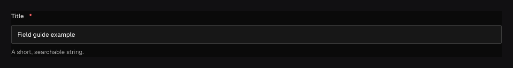

Use `field.Text` for a short, unformatted string: a title, name, reference code, or single-line
summary. It stores a string and shows a single-line input in the admin.

## In the admin {#admin-behavior}



_Changing its label affects only the editor; changing `title` changes the stored and API path._

## Add a text input {#example}

```go title="content/posts.go"
field.Text("title").Required()
```

The document property is `title`. Authors see a label derived from that name unless you provide
`.Label("Post title")`.

## Configuration {#configuration}

| Constructor or method                                           | What it controls                                                                        |
| --------------------------------------------------------------- | --------------------------------------------------------------------------------------- |
| `field.Text(name)`                                              | Creates the stored string field; `name` becomes its document and API key.               |
| `.Required()`                                                   | Rejects missing, null, and empty text.                                                  |
| `.MinLength(n)` / `.MaxLength(n)`                               | Sets inclusive Unicode-character bounds.                                                |
| `.Default(value)` / `.DefaultFrom(callback)`                    | Supplies a fixed or request-aware value when a new scope omits the field.               |
| `.Unique()` / `.Index()`                                        | Adds uniqueness or a query index through adapter-owned migrations.                      |
| `.Localized()`                                                  | Stores a separate value for each configured content locale.                             |
| `.Validate(callback)` / `.LiveValidate(callback)`               | Adds save validation or optional feedback while editing.                                |
| `.Admin(...)`, `.Access(...)`, `.Hooks(...)`, `.AfterRead(...)` | Configures presentation, authorization, saved-value lifecycle, and response transforms. |

## Limit length and require unique values {#options}

```go title="content/products.go"
field.Text("sku").
	Required().
	MinLength(3).
	MaxLength(32).
	Unique().
	Index().
	Admin(field.Admin{
		Description: "The identifier used by fulfilment.",
	})
```

`MinLength` and `MaxLength` count the submitted string. `Required` rejects missing, null, and empty
values. `Unique` prevents two documents in the collection from using the same value. Use `Index`
for a field you regularly filter or sort.

Use `.Default("Untitled")` for a fixed initial value or `.DefaultFrom(callback)` to choose one
on the server, for example a title in the content locale. See
[Set default field values](/docs/fields/defaults/) for a complete example.

Use `.Admin(field.Admin{...})` for descriptions, placeholders, layout, and visibility. To replace
the text input, set `Admin.Editor` to a
[custom field component](/docs/custom-components/field-components/).

Presentation options do not grant access. Protect sensitive strings with field access rules even
when the admin hides or disables the control.

## Querying and localization {#querying}

Text fields support string operators such as equality, containment, and `like`, plus sorting and
selection. Use the field path (`title` or `seo.title`) in Local API and REST queries; the
generated SDK exposes that path in its `where` type.

`.Localized()` stores one value per configured content locale. Required and unique checks are
evaluated per locale, and reads obey the request's locale and fallback chain. Do not add
`Localized` merely to translate the admin label—use `LabelTranslations` for interface copy.

## Common mistakes {#troubleshooting}

- Use [Textarea](/docs/fields/textarea/) for multi-line plain text and [Rich text](/docs/rich-text/)
  for formatted documents.
- A field rename changes stored data and generated APIs. Create a reviewed migration instead of
  changing the string literal casually.
- `ReadOnly` and `Hidden` affect only the admin. They do not prevent API writes.
- For an automatically generated URL identifier, use [Slug](/docs/fields/slug/) rather than
  rebuilding slug hooks around a plain text field.

See [`field.Text`](/reference/field/text/) and the shared [field options](/docs/fields/#field-options).

For an ordered list of free strings, use [TextList](/docs/fields/lists/).
It is a separate concrete field type; scalar Text callbacks continue receiving `string`.
