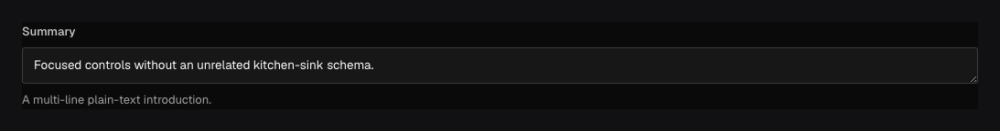

Use `field.Textarea` for multi-line **plain text** such as a synopsis, internal note, or address. It
stores a string—the line breaks are part of that string—and renders a larger text control in the
admin.

## In the admin {#admin-behavior}



_Line breaks remain part of one string; the control does not create rich-text structure._

## Add a multi-line input {#example}

```go title="content/posts.go"
field.Textarea("summary").MaxLength(280)
```

Create and update inputs accept `summary: string`; optional fields may be omitted. Reads return the
same plain string through REST, the Local API, and the generated SDK.

## Configuration {#configuration}

| Constructor or method                                           | What it controls                                                       |
| --------------------------------------------------------------- | ---------------------------------------------------------------------- |
| `field.Textarea(name)`                                          | Creates a stored multi-line plain-text string.                         |
| `.Required()`                                                   | Rejects missing, null, and empty text.                                 |
| `.MinLength(n)` / `.MaxLength(n)`                               | Sets inclusive Unicode-character bounds.                               |
| `.Default(value)` / `.DefaultFrom(callback)`                    | Supplies fixed or request-aware initial text.                          |
| `.Localized()`                                                  | Stores separate text for each configured content locale.               |
| `.Validate(callback)` / `.LiveValidate(callback)`               | Adds save validation or optional feedback while editing.               |
| `.Admin(...)`, `.Access(...)`, `.Hooks(...)`, `.AfterRead(...)` | Configures the editor, authorization, saved value, and returned value. |

## Set length limits and a placeholder {#options}

```go title="content/reviews.go"
field.Textarea("editorNote").
	Required().
	MinLength(10).
	MaxLength(2_000).
	Admin(field.Admin{
		Placeholder: "Explain what must change before publication…",
		Sidebar:     true,
	})
```

Textarea fields accept the common string options: `Required`, `MinLength`, `MaxLength`, `Default`,
`Localized`, `Unique`, `Index`, and the shared admin options. Long prose rarely needs to be
unique or indexed.

Localization stores an independent string per content locale. Admin-language translations for the
label, description, or placeholder are separate and do not localize content.

## Search and display plain text {#querying}

String filters work as they do for [Text](/docs/fields/text/), including equality, containment,
`like`, selection, and sorting. Long text queries are not relevance-ranked search. Use a separate search integration when
your application needs ranked results or language-aware matching.

Textarea does not parse Markdown or HTML and does not sanitize it for rendering. Escape plain text
in your frontend. If authors need formatting, links, uploads, or structured blocks, use the
[Rich-text plugin](/docs/rich-text/) or [Blocks](/docs/fields/blocks/).

## Common mistakes {#troubleshooting}

- Do not store an object or arbitrary array in a textarea; use [JSON](/docs/fields/json/) or model
  the shape with fields.
- `MaxLength` limits characters accepted by Ridu; it does not visually truncate the control.
- Hiding a note in the admin is not a field access rule.

See [`field.Textarea`](/reference/field/textarea/) and [access control](/docs/access-control/).
