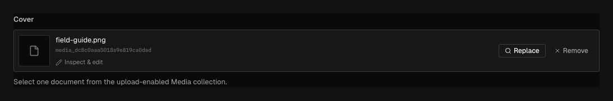

Use `field.Upload` when a document refers to media stored as an upload-enabled collection
document. The file bytes belong to the configured storage backend; this field stores the media
document reference.

## In the admin {#admin-behavior}



_The control selects a media document; the field stores its reference while bytes remain in object storage._

## Define the target and field {#example}

```go title="content/media.go"
var Media = ridu.Collection{
	Slug:   "media",
	Upload: true,
	Fields: []field.Definition{
		field.Text("alt", field.Required()),
	},
}
```

```go title="content/posts.go"
field.Upload(
	"heroImage",
	field.To("media"),
	field.Required(),
	field.OnDelete(field.ReferenceDeleteRestrict),
)
```

An Upload must target exactly one existing collection with `Upload: true`. Use `HasMany()` or the
`ToMany("media")` shorthand for a gallery.

## Authoring, filtering, and reads {#options}

The admin provides an access-aware media picker. `FilterOptionRules` can narrow candidates by
metadata such as MIME type or a current-document value, and the server revalidates the rule on
write. Upload also supports `Required`, `Localized`, delete behavior, conditions, and common
presentation options.

Without population, reads return the stored ID/reference. Request population when a response needs
the media document and its server-owned filename, MIME, dimensions, sizes, or authored `alt` data.
Target access and redaction still apply.

This field does not upload bytes by itself. Create media through the generated SDK's `upload` or
`uploadFromURL` methods, the multipart REST endpoint, or the admin, then select the resulting
document.

## Common mistakes {#troubleshooting}

- Setting `field.To("media")` does not make `media` upload-enabled.
- Never submit or expose raw storage object keys as if they were media references.
- Required uploads cannot use nullify-on-delete. Decide retention and permanent deletion behavior
  before authors build references.
- Database and object storage must be backed up and restored as one recovery point.

See [`field.Upload`](/reference/field/upload/) and [Uploads and media](/docs/uploads/) for ingestion,
image variants, delivery, cleanup, and storage ownership.
