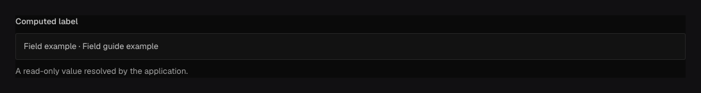

Use `field.Virtual` to calculate a value when a document is read. For example, combine first and
last names into a display name. The value appears in API responses and generated output types,
but is not stored and cannot be submitted when creating or updating a document.

## In the admin {#admin-behavior}



_The admin displays the calculated value as read-only._

## Calculate a display name {#example}

```go title="content/people.go"
package content

import (
	"github.com/riducms/ridu"
	"github.com/riducms/ridu/field"
	"github.com/riducms/ridu/operation"
	"github.com/riducms/ridu/store"
)

var People = ridu.Collection{
	Slug: "people",
	Fields: field.Fields{
		field.Text("firstName").Required(),
		field.Text("lastName").Required(),
		field.Virtual("displayName", field.ValueString,
			func(
				ctx operation.Context,
			) (operation.Value[store.Value], error) {
				first, _ := ctx.Root.String("firstName")
				last, _ := ctx.Root.String("lastName")
				return operation.Present(store.String(first + " " + last)), nil
			}),
	},
}
```

### Read sibling values {#sibling-data}

Virtual fields are root fields, so their sibling values live in `ctx.Root`. In the
example, `displayName` reads the stored `firstName` and `lastName` siblings with `ctx.Root.String(...)`.
The second return value reports whether the value is actually a string; the example can ignore it
because both source fields are required Text fields.

Read other fields with `ctx.Root.Get("name")`. On the returned value, call `BooleanValue()` for
a checkbox or `NumberValue()` for a number. Read a Group or named tab's children with `Get`,
and iterate an Array or Blocks list with `Elements()`. These reads share immutable values
without copying the containers. A Relationship or Upload contains its saved ID or reference. Use
`ctx.Local` to read the related document with the current user’s access rules.

Choose `ValueString`, `ValueNumber`, `ValueBoolean`, or `ValueJSON`. The resolver must return the
matching `operation.Value[store.Value]`. Missing resolvers fail startup; a mismatched runtime value fails the
operation.

Virtual fields must live at a collection or global root. Resolvers receive the operation, actor and
auth collection, current document, locale selection, context, and access-controlled Local API. Use
that Local API for additional reads.

## Configuration {#configuration}

| Constructor or method                                                     | What it controls                                                                          |
| ------------------------------------------------------------------------- | ----------------------------------------------------------------------------------------- |
| `field.Virtual(name, valueType, resolver)`                                | Declares the response key, finite output type, and Go callback that calculates it.        |
| `field.ValueString`, `ValueNumber`, `ValueBoolean`, and other value types | Tell generation and runtime validation which `store.Value` kind the resolver must return. |
| `.Access(...)` / `.RestrictAccess(...)`                                   | Controls whether the computed output is visible to the caller.                            |
| `.AfterRead(...)`                                                         | Transforms the resolved response value before final redaction.                            |
| `.Admin(...)`                                                             | Sets label, description, position, width, and read-only presentation.                     |

Virtual has no default, requiredness, write validator, write hook, localization setting, or stored
column. Its resolver returns `operation.Empty[store.Value]()` for no output or
`operation.Present(...)` with a value of the declared type.

## Avoid unnecessary work when reading lists {#behavior}

Ridu skips a virtual field when it is not selected in the read. If a calculation is expensive,
request it only on the screens that need it. Be especially careful with list reads: a network
request for every row can make the whole list slow. Cache repeated work where appropriate and
handle failures. Field read access rules still apply to the calculated value.

## Common mistakes {#troubleshooting}

- Do not try to filter or sort by a value that is never stored. Save the calculated value in a stored field when
  the database needs to filter or sort it.
- Avoid nondeterministic or secret-bearing output unless an access rule permits it.
- A Virtual is not an admin-only UI element; use [UI](/docs/fields/ui/) for presentation with no
  response value.

See [`field.Virtual`](/reference/field/virtual/) and [`field.Resolver`](/reference/field/resolver/).
