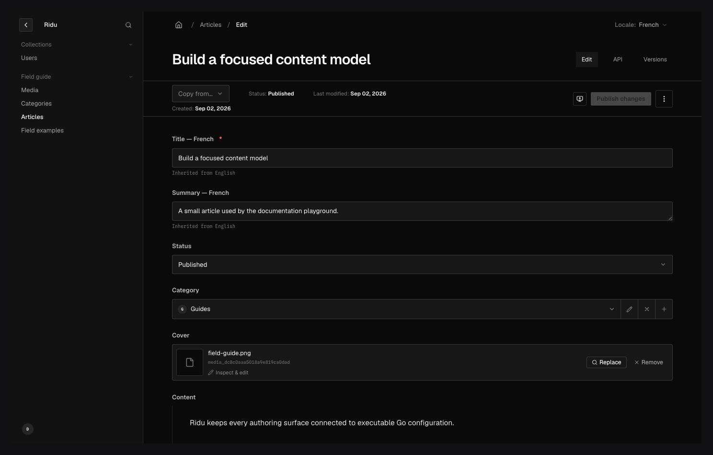

Ridu localizes authored content, not its application code. A field opts into locale-specific stored
values while unlocalized fields remain shared. The selected locale flows through reads, writes,
filters, counts, sorting, relationships, access rules, hooks, drafts, versions, duplication, and
the admin.

Content locale and admin interface language are independent. Content localization controls stored
values and request projection. `Admin.Localization` controls statically bundled interface catalogs,
translated application labels, text direction, and the timezone used for `Intl` date/number
formatting. An editor may author French content while using the English interface.

## Configure locales {#configure}

Declare an ordered locale list and a default locale on the application config:

```go title="content/config.go"
func Config() ridu.Config {
	return ridu.Config{
		Name: "Editorial",
		Localization: ridu.LocalizationConfig{
			DefaultLocale: "en",
			Locales: []ridu.Locale{
				{Code: "en", Label: "English"},
				{Code: "fr", Label: "Français", FallbackLocales: []schema.LocaleCode{"en"}},
				{Code: "ar", Label: "العربية", RTL: true, FallbackLocales: []schema.LocaleCode{"en"}},
			},
		},
		Collections: []ridu.Collection{Posts},
	}
}
```

Locale codes are case-sensitive stable identifiers. Resolution rejects empty or duplicate codes,
unknown defaults and fallback targets, self-fallback, cycles, and request-reserved tokens such as
`all`, `*`, `false`, `none`, and `null`.

Fallback is enabled by default. Set `DisableFallback: true` globally when exact-locale reads should
be the default; individual requests can still provide their own explicit chain.

## Mark fields as localized {#localized-fields}

Use `field.Localized()` on scalar, relationship, upload, nested, or plugin fields that support
stored content:

```go title="content/posts.go" add={5,7,10}
var Posts = ridu.Collection{
	Slug: "posts",
	Fields: []field.Definition{
		field.Text("slug", field.Required(), field.Unique()),
		field.Text("title", field.Required(), field.Localized()),
		field.Group("seo", field.Fields(
			field.Text("title", field.Localized()),
			field.Text("canonicalURL"),
		)),
		field.Relationship("editor", field.To("users"), field.Localized()),
	},
}
```

Putting `Localized()` on a group, array, or blocks field localizes the complete parent value.
Localized descendants under an unlocalized parent are independently localized. Ridu preserves
array and block row identity when another locale is edited.

A required localized field is validated for the locale being written; one mutation does not need
to provide every translation. Locale-scoped unique fields enforce uniqueness within each locale.



_The interface remains English while the content locale is French. “Inherited from English” shows
the fallback source before an author writes a French value._

## Read one locale {#read-one}

An omitted locale selects the configured default. The SDK accepts a locale and either an explicit
fallback chain or `false` for an exact read:

```ts
const french = await client.find('posts', 'post_123', {
	locale: 'fr',
	fallbackLocale: ['en']
});

const exactFrench = await client.find('posts', 'post_123', {
	locale: 'fr',
	fallbackLocale: false
});
```

REST uses `locale=fr` and `fallback-locale=en` (or the camel-case `fallbackLocale` alias). The local
Go API uses `ridu.LocaleOptions` or the locale fields on list/find/mutation options.

Fallback happens after the target document passes access filtering. It cannot expose a value from
an unauthorized row or reintroduce a redacted field. The REST document includes
`_localization.sources`, keyed by authored field path, so an editor or frontend can distinguish an
exact value from an inherited fallback. An empty string remains visible in an exact read but counts
as missing when fallback is enabled.

## Read every locale {#read-all}

Use `locale: 'all'`, REST `locale=all` (or `*`), or `AllLocales: true` to receive locale-keyed values
for localized fields. Shared fields keep their ordinary shape:

```json title="All-locales response fragment"
{
	"id": "post_123",
	"slug": "hello-ridu",
	"title": {
		"en": "Hello, Ridu",
		"fr": "Bonjour, Ridu",
		"ar": "مرحباً Ridu"
	}
}
```

All-locale reads apply field access inside every locale and population branch. Ordinary create and
update requests cannot target `all`; write one selected locale or use the dedicated copy operation.

Generated TypeScript distinguishes a literal `locale: 'all'` call from a single-locale call. When a
runtime variable may contain either shape, the result remains the corresponding union and consumer
code must narrow it rather than casting an all-locale result to a single-locale document.

## Write without erasing translations {#write}

Writing one locale changes only that locale's localized values. Unlocalized values update normally,
and stored values for other locales are preserved:

```ts
await client.update('posts', 'post_123', { title: 'Bonjour, Ridu' }, { locale: 'fr', revision: 7 });
```

Filters, counts, sort, relationships, uploads, versions, drafts, restore, duplicate, trash, and
publishing all use the same selected locale contract. Historical version snapshots retain the
localized state needed for a faithful restore.

## Copy a locale {#copy-locale}

Copying is an explicit mutation rather than a read-and-write performed in the browser:

```ts
await client.copyLocale('posts', 'post_123', { from: 'en', to: 'fr' }, { revision: 7 });
```

Ridu checks source read access, destination write access, validation, and optimistic concurrency in
one transaction. The local API exposes `CopyLocale`; REST uses
`POST /api/collections/{collection}/{id}/copy-locale`. Globals have matching local, REST, and SDK
operations.

## Limit locales per author {#available-locales}

`AvailableLocales` is an executable Go callback that can reduce the locale list shown to one
authenticated admin user. It receives the actor, exact auth collection, context, and local API. The
callback is never serialized into the manifest.

This is presentation availability, not authorization. API requests still validate against the
configured locale set, and field/collection access rules remain responsible for protecting values.
Returning an unknown, duplicate, or empty locale list fails closed with
`locale_availability_failed`.

## Configure the admin interface language {#admin-language}

Ridu publishes complete English, French, and Arabic catalogs in `@riducms/translations`. Declare
the languages and editor timezones in Go, then statically pass matching catalogs to `mountAdmin`.
The Go manifest carries only deterministic language/timezone metadata; translated message catalogs
remain compiled TypeScript modules.

```go title="content/config.go"
Admin: ridu.AdminConfig{
	User: "users",
	Localization: ridu.AdminLocalizationConfig{
		Languages: []ridu.AdminLanguage{
			{Code: "en", Label: "English"},
			{Code: "fr", Label: "Français"},
			{Code: "ar", Label: "العربية", RTL: true},
		},
		DefaultLanguage: "en",
		TimeZones: []ridu.AdminTimeZone{
			{ID: "UTC", Label: "UTC"},
			{ID: "Europe/Paris", Label: "Paris"},
		},
		DefaultTimeZone: "UTC",
	},
},
```

Install the direct admin dependency if the project does not already declare it:

```bash title="terminal" package-manager="bun"
bun add --cwd admin @riducms/translations
```

```bash title="terminal" package-manager="npm"
npm install --workspace admin @riducms/translations
```

```bash title="terminal" package-manager="pnpm"
pnpm --dir admin add @riducms/translations
```

```bash title="terminal" package-manager="yarn"
yarn --cwd admin add @riducms/translations
```

```ts title="admin/src/main.ts"
import { mountAdmin } from '@riducms/admin';
import { ar, en, fr } from '@riducms/translations';
import { createClient, type RiduConfig } from '../../generated/ridu.generated';
import { adminPlugins } from '@/plugins';

mountAdmin<RiduConfig>({
	target: document.getElementById('app')!,
	clientFactory: () => createClient({ baseURL: window.location.origin }),
	plugins: adminPlugins,
	languages: [en, fr, ar]
});
```

Configured Go language codes must have matching static catalogs, including the same RTL setting;
the admin fails closed on a missing or conflicting catalog. `defineTranslationLanguage` and
`extendTranslationLanguage` support complete application-owned catalogs. Admin plugins may ship
namespaced translated messages without mutating Ridu's core catalog.

Fields, choices, blocks, tabs, collection/global labels, application name, and timezone labels have
typed `*Translations` metadata. The active interface language selects that metadata while preserving
the canonical fallback text. Authors choose language and timezone in their account settings; Ridu
stores the preference and uses `Intl` plural, number, relative-time, and date formatting.

## Admin behavior and current boundary {#admin}

The admin remembers an author's locale preference, shows each fallback source, preserves dirty
state across locale switches, requires an explicit decision before saving inherited content, and
sets right-to-left editing direction for RTL locales, including rich text.

Locale-specific draft status is not a Ridu contract: a document's draft/published status applies to
the document rather than independently to each locale. Interface language does not automatically
translate application-authored content, and content locale does not override the editor's selected
interface language or timezone.

See [Querying data](/docs/querying/) for locale-aware filters and population, [Access control](/docs/access-control/)
for locale context in rules, and the [`core` reference](/reference/core/) for exact Go fields.
