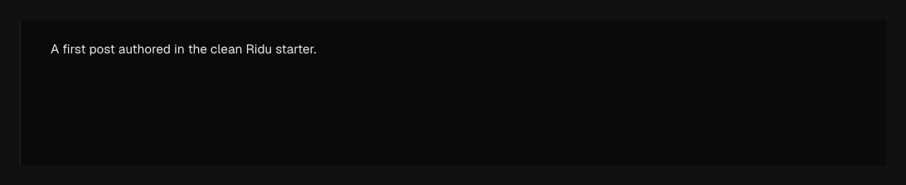

The rich-text plugin lets editors write formatted content, insert media, and add custom blocks
such as callouts. Choose the available tools and block fields in Go. The admin provides a Svelte 5
editor built with Lexical, and your frontend can display the saved content with Go, JavaScript,
or Svelte.

Content is saved as JSON. You decide how it looks on your website; the admin editor does not become
part of your frontend.

## Configuration {#configuration}

| Option or method                     | Default                                                     | What it controls                                                                                       |
| ------------------------------------ | ----------------------------------------------------------- | ------------------------------------------------------------------------------------------------------ |
| `richtext.Field(name)`               | Recommended feature set                                     | Adds the official rich-text plugin field.                                                              |
| `richtext.Field(name, config)`       | —                                                           | Supplies one explicit `richtext.Config`; more than one config panics.                                  |
| `Config.Features`                    | Links, lists, code, horizontal rule, uploads, relationships | Replaces the optional toolbar/insert features. An explicit empty slice disables all optional features. |
| `Config.UploadCollections`           | All compatible upload collections                           | Restricts media choices and server validation to the listed slugs.                                     |
| `Config.RelationshipCollections`     | All compatible collections                                  | Restricts related-document choices and server validation to the listed slugs.                          |
| `Config.Blocks`                      | None                                                        | Adds inline block definitions owned by this rich-text field.                                           |
| `Config.BlockReferences`             | None                                                        | Selects definitions registered in root `Config.Blocks`; exclusive with inline `Blocks`.                |
| Field `.Required()` / `.Localized()` | Optional, shared value                                      | Requires content or stores a complete rich-text document per locale.                                   |
| `richtext.RenderHTML(...)`           | —                                                           | Renders a validated document in Go with callbacks for application blocks and references.               |

## Use it in a new project {#new-project}

The `starter` template already installs and registers rich text. Open `content/posts.go`, use
`richtext.Field("content")`, then run `ridu dev`. Do not add a second registration.

If you chose the `blank` template, follow the existing-project installation below.

## Add it to an existing project {#existing-project}

Add the Go and admin packages together:

```bash title="terminal"
npm run ridu -- add richtext \
  --go-package github.com/riducms/ridu/plugins/richtext \
  --admin-package @riducms/plugin-richtext
```

The command registers the plugin for you. Keep `installedPlugins()` in your existing Go config,
and add a rich-text field to a collection. For example:

```go title="content/config.go"
package content

import (
	"github.com/riducms/ridu"
	"github.com/riducms/ridu/field"
	"github.com/riducms/ridu/plugins/richtext"
)

func Config() ridu.Config {
	return ridu.Config{
		Name:        "Acme Editorial",
		Plugins:     installedPlugins(),
		Collections: []ridu.Collection{Posts},
	}
}

var Posts = ridu.Collection{
	Slug: "posts",
	Fields: field.Fields{
		field.Text("title").Required(),
		richtext.Field("content").Required(),
	},
}
```

Start the development server:

```bash title="terminal"
npm run dev
```

Open Posts in the admin and create a document. Add bold text and a link, save, then reload the page.
The formatting should remain. Read the document through your generated SDK to see its JSON value.

Before deploying the new field, create and check its database migration:

```bash title="terminal"
npm run ridu -- migrate create --name add-rich-text
npm run ridu -- migrate plan
npm run ridu -- migrate verify
npm run ridu -- check
```

Review the migration, apply it with `migrate up` during deployment, and confirm `migrate status`
has no pending steps. See [Migrations](/docs/migrations/) for the database connection options.

## What editors can do {#defaults}

With the default configuration, editors can add:

- links;
- numbered, bulleted, and check lists;
- code blocks and horizontal rules;
- uploaded media with a caption for each use;
- links to documents in other collections; and
- headings, quotes, alignment, indentation, line breaks, and inline bold, italic, underline,
  strike-through, subscript, superscript, and code.

Type `/` to open the insert menu, or select text to open the formatting toolbar. Media and related
documents use the same picker as ordinary upload and relationship fields. Removing one of these
cards removes it from the article without deleting the original file or document.



A media card can have its own caption without changing the file's shared `alt` text:

```json
{
	"type": "upload",
	"version": 1,
	"relationTo": "media",
	"id": "asset_123",
	"caption": "A crop used only in this article"
}
```

The picker only shows documents the user may access. These simple media and relationship cards
store a collection name and document ID. Saving checks their format and whether that collection is
allowed, but it does not check that the document still exists. Deleting the original can leave a
broken reference.

For stronger reference handling, put an ordinary upload or relationship field inside a
[custom block](#blocks). Those fields can check that the target exists, populate its data, and
control what happens when it is deleted.

## Choose the available editing tools {#features}

Pass a `richtext.Config` to choose optional tools and restrict which collections can be selected.
Omit `Features` to keep the defaults. If you supply a list, it replaces the default list;
`Features: []richtext.Feature{}` disables all optional tools while keeping basic text formatting.

```go
richtext.Field("content", richtext.Config{
	Features: []richtext.Feature{
		richtext.FeatureLinks,
		richtext.FeatureLists,
		richtext.FeatureCode,
		richtext.FeatureHorizontalRule,
		richtext.FeatureUploads,
		richtext.FeatureRelationships,
	},
	UploadCollections:       []string{"media"},
	RelationshipCollections: []string{"posts", "pages"},
}).Required()
```

In this example, the media picker shows only `media`, and the relationship picker shows `posts`
and `pages`. Omit a collection list to allow all compatible collections. Ridu checks these
restrictions when saving as well as in the picker.

## Add custom blocks {#blocks}

A block adds structured content between paragraphs: a callout, image gallery, or call-to-action,
for example. Define its fields in Go just as you would for a collection. This example adds a
Callout block with a title, a translatable message, and a related Post:

```go title="content/articles.go"
callout := field.Block{
	Slug:     "callout",
	TypeName: "ArticleCallout",
	Fields: field.Fields{
		field.Text("title").Required(),
		field.Textarea("message").Localized(),
		field.Relationship("related", "posts"),
	},
}

body := richtext.Field("body", richtext.Config{
	Blocks: []field.Block{callout},
})
```

Add `body` to the collection's `Fields` list. With the development server running, open the editor
and choose Callout from the insert menu. Fill in its fields, then choose Apply to insert it into
the article or Cancel to discard it. You can edit, duplicate, move, or remove the card afterward,
and undo or redo those changes.

Finish or cancel changes in a block drawer before saving the article. Apply updates the editor;
the article's Save button sends the complete document to Go, where validators and hooks run.
Errors appear on the affected card and its fields.

Adding `Blocks` enables the block tools alongside the defaults. If you also provide a `Features`
list, include `richtext.FeatureBlocks`. Ridu only accepts block types listed in `Blocks`.

Blocks can contain groups, arrays, uploads, relationships, and another rich-text field. Their
fields keep the normal defaults, validation, hooks, and permissions. [Dynamic defaults](/docs/fields/defaults/)
run on the server when the parent document is saved; they do not prefill an unsaved embedded form. A field cannot contain its
own definition through an endless chain of nested blocks.

### Translate blocks {#block-localization}

Call `.Localized()` on the rich-text field to give each locale its own complete article.
Alternatively, localize individual fields inside a block, such as `message` above. In that case,
the surrounding text and block order stay shared: moving or deleting a block affects every locale.
Copying a locale copies those translated values into the same blocks.

Block values belong to the article, so they are saved in its drafts and version history.
Permissions on a child field can also prevent removing the block that contains it.

### Read block data {#block-data}

In the saved JSON, a block's values appear under `fields`:

```json
{
	"type": "block",
	"version": 1,
	"fields": {
		"_key": "stable-key",
		"blockType": "callout",
		"title": "Read first"
	}
}
```

`blockType` identifies the block, and `_key` identifies this particular use of it. Ridu supplies
a missing key when a block is inserted. Do not use either reserved name for your own fields.
Unknown block types and undeclared fields cause validation errors.

Ridu generates Go and TypeScript types for each configured block, including separate types for
creating and updating it. The same definitions appear in OpenAPI. See the
[blocks example](https://github.com/riducms/ridu/tree/main/examples/blocks) for an application that
creates, updates, and renders typed blocks.

A rich-text field is stored as one JSON value. If you need to filter or update content independently
of its article, use a separate collection or a regular field outside the rich text. Large articles
also produce larger reads, writes, and version snapshots.

## Understand the saved JSON {#document}

The saved field has a `version` and a `root` containing its text and other content. For example:

```json
{
	"version": 1,
	"root": {
		"type": "root",
		"children": [
			{
				"type": "paragraph",
				"children": [
					{ "type": "text", "text": "Hello, Ridu", "format": 1 }
				]
			}
		]
	}
}
```

Each object inside `children` is called a **node**. A paragraph contains text nodes; a list contains
list items. Ridu checks these objects when saving and reports the path of invalid content, such as
a link with no URL or a block type you have not configured.

Documents may contain at most 10,000 nodes and nest at most 64 levels deep. Unsupported document
versions are rejected. Changing the document version requires a content migration.

## Display rich text with Go {#render-html}

Use `richtext.RenderDocument` with a generated Go document type. It renders the built-in formatting
and calls your function for custom blocks, so you can choose their HTML. The
[Go rendering example](https://github.com/riducms/ridu/blob/main/examples/blocks/render/article.go)
shows how to handle each generated block type.

If you are working with a raw `store.Value`, use `richtext.RenderHTML`. Supply functions for media,
relationships, and custom blocks:

```go
html, err := richtext.RenderHTML(
	value,
	map[string]func(store.Values) (string, error){
		"upload": func(node store.Values) (string, error) {
			return renderUploadReference(ctx, node)
		},
		"relationship": func(node store.Values) (string, error) {
			return renderRelationshipReference(ctx, node)
		},
		"block": func(node store.Values) (string, error) {
			return renderApplicationBlock(ctx, node)
		},
	},
)
if err != nil {
	return err
}
```

Built-in text is escaped, and links must be relative or use `http`, `https`, `mailto`, or `tel`.
Your rendering functions must escape their own field values. Fetch related content through the
local API so the user's permissions still apply; do not treat a stored document ID as a URL.

## Display rich text on your frontend {#frontend}

Fetch the document through your generated SDK, then pass its rich-text field to a renderer.
For JavaScript or TypeScript, use `renderRichTextHTML`:

```ts
import { renderRichTextHTML } from '@riducms/plugin-richtext/render';

const html = renderRichTextHTML(article.content);
```

Here, `article.content` is a saved rich-text value. Check it is present before rendering an optional
field. This renderer works without Svelte or a browser and does not include the admin editor.

For Svelte, import `RichText` from `@riducms/plugin-richtext/svelte` and render
`<RichText value={article.content} />`. To display custom blocks, pass a `blocks` object that maps
each block's key to a Svelte component. Each component receives the fields for its block type.
The [Svelte rendering example](https://github.com/riducms/ridu/blob/main/examples/blocks/render/Article.svelte)
shows a complete mapping.

The TypeScript equivalent maps keys to functions that return HTML. Use
`RichTextBlockRenderers` to check that every block has a function, or `RichTextBlockComponents`
for Svelte components. Missing renderers cause an error unless you provide a visible fallback.
Renderers do not fetch related documents; load that data before rendering it.

Tables, custom inline content, Markdown shortcuts, HTML/Markdown import and export, plain-text
rendering, and collaborative editing are not available yet.

## Change block definitions safely {#migrations}

Renaming a block, removing it, or changing its fields may affect existing articles and revisions.
Use [Migrations](/docs/migrations/) to update stored content, including the locales and revision
history you intend to keep. Disposable development content can be recreated instead.

If saved content contains a block type that is no longer configured, Ridu reports
`block_recovery_required` and blocks saving. Restore the previous block definition to read and edit
it again, or export the original JSON and write a Go migration to convert it. The admin keeps
unsaved values after a schema reload and offers a recovery export.

See the [`richtext` Go reference](/reference/richtext/), the
[`@riducms/plugin-richtext` reference](/reference/plugin-richtext/), [Uploads](/docs/uploads/),
and [Build a field plugin](/guides/custom-fields/).
