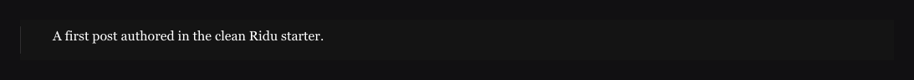

A rich-text field starts with a recommended set of editing tools. This page shows what editors can
do with them and how to choose a different set.

## What editors can do {#defaults}

With the default configuration, editors can add:

- links;
- numbered, bulleted, and check lists;
- code blocks and horizontal rules;
- uploaded media with a caption for each use;
- links to documents in other collections; and
- headings, quotes, alignment, indentation, line breaks, and inline bold, italic, underline,
  strike-through, subscript, superscript, and code.

Type `/` to search the insert menu. The block action beside a paragraph opens a picker for inserting
another block. Select text to open the formatting toolbar: choose a paragraph, heading, quote, or
list style; apply inline marks such as **bold** or `code`; or adjust alignment and indentation.
Its link and list controls appear only when those features are enabled. To keep the same controls
visible above the editor, [pin a toolbar](/docs/rich-text/toolbar-and-layout/#fixed-toolbar).



## Add or change a link {#links}

Select text and choose **Link** from the toolbar, or press `Ctrl+K` (`⌘K` on macOS). The link drawer
lets you change the display text and URL and choose whether the link opens in a new tab. When the
caret is inside an existing link, the link options let you open, edit, or remove it. Cancel leaves
the document as it was; removing a link keeps its text and can be undone.

An address such as `ridu.dev/docs` becomes `https://ridu.dev/docs`. Relative paths and `http`,
`https`, `mailto`, and `tel` URLs are accepted. Unsafe schemes such as `javascript:` are rejected
before a link is inserted and during rendering.

## Type formatting shortcuts {#shortcuts}

Common Markdown patterns turn into rich-text nodes as you type: `#` through `######` for headings,
`>` for a quote, list markers for numbered, bulleted, or check lists, backticks for inline or block
code, and `[label](https://example.com)` for a link. Bold, italic, and strike-through markers also
work. These are typing shortcuts, not Markdown import or export; the saved value is still the
versioned JSON document. Optional shortcuts follow `Config.Features`, so disabling links, lists, or
code also removes their corresponding shortcuts.

## Choose the editing tools {#features}

Pass a `richtext.Config` to choose optional tools and restrict which collections can be selected.
Omit `Features` to keep the defaults. If you supply a list, it replaces the default list;
`Features: []richtext.Feature{}` disables all optional tools while keeping basic text formatting.

```go
richtext.Field("content", richtext.Config{
	Features: []richtext.Feature{
		richtext.FeatureLinks,
		richtext.FeatureLists,
		richtext.FeatureCode,
		richtext.FeatureHorizontalRule,
		richtext.FeatureUploads,
		richtext.FeatureRelationships,
	},
	UploadCollections:       []string{"media"},
	RelationshipCollections: []string{"posts", "pages"},
}).Required()
```

In this example, the media picker shows only `media`, and the relationship picker shows `posts`
and `pages`. Omit a collection list to allow all compatible collections. Ridu checks these
restrictions when saving as well as in the picker.

## Caption media and link documents {#references}

Media and related documents use the same picker as ordinary upload and relationship fields.
Removing one of these cards removes it from the article without deleting the original file or
document. A media card can have its own caption without changing the file's shared `alt` text:

```json
{
	"type": "upload",
	"version": 1,
	"relationTo": "media",
	"id": "asset_123",
	"caption": "A crop used only in this article"
}
```

The picker only shows documents the user may access. These cards store a collection name and
document ID. Saving checks their format and whether that collection is allowed, but it does not
check that the document still exists. Deleting the original can leave a broken reference.

For stronger reference handling, put an ordinary upload or relationship field inside a
[custom block](/docs/rich-text/blocks/). Those fields can check that the target exists, populate its
data, and control what happens when it is deleted.
