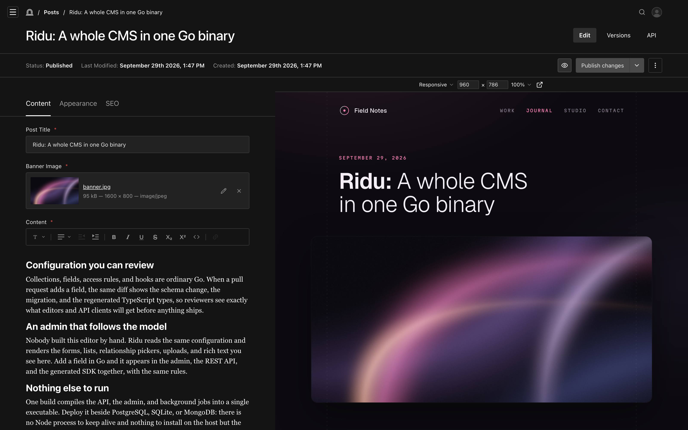

By default, formatting controls appear in a small toolbar over selected text, and a gutter along the
editor's edge holds a handle for moving each block. Use `Config.Admin` to change how the editor
looks in the admin. These settings never change what a document can store or how it is validated.

## Pin a toolbar above the editor {#fixed-toolbar}

Set `FixedToolbar` to keep the formatting controls visible above the text:

```go title="content/posts.go"
richtext.Field("content", richtext.Config{
	Admin: richtext.Admin{
		FixedToolbar: true,
	},
}).Required()
```

The toolbar shows the current block style and marks for the caret or selection. It stays in view
while you scroll a long document, and the toolbar over selected text still appears as well. A
button pressed before the editor has a caret places one at the end of the content. Adding a link
needs selected text; removing one works from the caret.



_A fixed toolbar with the gutter hidden._

## Hide the gutter {#gutter}

Set `HideGutter` so the text lines up with the other fields in the form:

```go
richtext.Field("content", richtext.Config{
	Admin: richtext.Admin{
		FixedToolbar: true,
		HideGutter:   true,
	},
})
```

The block handle moves just outside the text, so it still appears when you hover a block.

## Hide block controls {#block-controls}

Each block shows a handle for dragging it and a **+** button for inserting another block, and a
control below the last block adds an empty paragraph. Hide any of them:

```go
richtext.Field("summary", richtext.Config{
	Admin: richtext.Admin{
		HideDraggableBlockElement: true,
		HideAddBlockButton:        true,
		HideInsertParagraphAtEnd:  true,
	},
})
```

Editors keep keyboard alternatives: `Alt+Shift+↑` and `Alt+Shift+↓` move the current block, `/`
opens the insert menu, and `Enter` at the end of the last block adds a paragraph.

## All options {#options}

| `richtext.Admin` field      | Default | Effect                                                        | Payload equivalent                |
| --------------------------- | ------- | ------------------------------------------------------------- | --------------------------------- |
| `FixedToolbar`              | `false` | Pins formatting controls above the editor.                    | `FixedToolbarFeature()`           |
| `HideGutter`                | `false` | Removes the line and indent along the editor's edge.          | `admin.hideGutter`                |
| `HideDraggableBlockElement` | `false` | Hides the handle for dragging a block.                        | `admin.hideDraggableBlockElement` |
| `HideAddBlockButton`        | `false` | Hides the **+** button beside the hovered block.              | `admin.hideAddBlockButton`        |
| `HideInsertParagraphAtEnd`  | `false` | Hides the control that adds a paragraph after the last block. | `admin.hideInsertParagraphAtEnd`  |

The toolbar over selected text is always available. Payload's `admin.placeholder`,
`applyToFocusedEditor`, and custom toolbar groups have no equivalent yet.

See [`richtext.Admin`](/reference/richtext/admin/) in the API reference.
