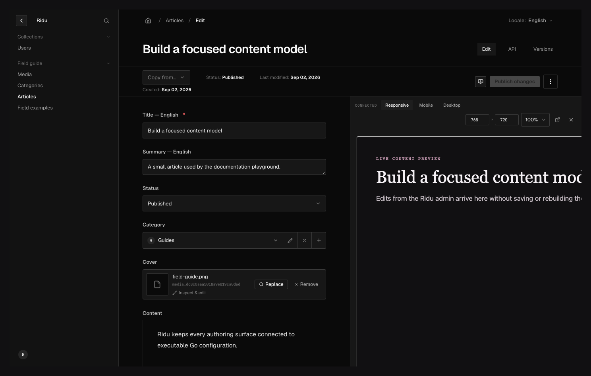

Ridu live preview has two complementary paths:

- a short-lived server capability lets the frontend fetch the saved, access-checked draft without
  receiving the author's admin cookie;
- a browser channel sends the current unsaved form values from the admin to an iframe or popup.

Browser messages make editing feel immediate, but they do not grant API access and must not be
persisted directly.

## Before you configure it {#requirements}

Live preview is available for versioned collections and globals with drafts enabled. The document
must already exist: the admin does not open a live-preview panel for an unsaved create form.

```go
Versions: true,
VersionConfig: ridu.VersionConfig{
	Drafts: true,
},
```

Your preview frontend can run in any framework. It only needs a server-side Fetch-compatible client
for capability reads and, if you want unsaved updates, a browser that can use `postMessage`.

## Configure the URL and viewports {#configure}

Set `Admin.LivePreview` on the collection or global. A URL can be an absolute HTTP(S) URL or an
absolute path resolved against the admin origin.

```go title="content/posts.go"
Admin: ridu.CollectionAdmin{
	LivePreview: ridu.LivePreviewConfig{
		URL: "https://www.example.com/preview/{collection}/{id}?slug={field:slug}",
		Breakpoints: []ridu.PreviewBreakpoint{
			{Name: "mobile", Label: "Mobile", Width: 390, Height: 844},
			{Name: "tablet", Label: "Tablet", Width: 820, Height: 1180},
			{Name: "desktop", Label: "Desktop", Width: 1440, Height: 900},
		},
	},
},
```

The URL template accepts:

| Placeholder             | Value                                             |
| ----------------------- | ------------------------------------------------- |
| `{id}`                  | Current document ID                               |
| `{collection}`          | Collection or global slug used by the admin route |
| `{field:path.to.value}` | Current scalar form value at a stored field path  |

Values are URL-encoded. Non-scalar or missing field values become an empty string. `ridu check`
rejects unknown stored paths, unsupported placeholders, malformed braces, non-HTTP absolute URLs,
duplicate breakpoint names, and non-positive dimensions. Breakpoint names are unique lowercase
kebab-case; an omitted label is humanized from the name.

When the panel opens, the admin adds two reserved query parameters:

- `__ridu_preview` identifies the browser message channel;
- `__ridu_preview_token` carries the short-lived read capability.

Preserve both parameters through application redirects.



_The panel reads the saved draft with a scoped capability and receives unsaved form updates through
a validated browser channel._

## Read the saved draft on the server {#server-read}

Use the generated client from your application frontend. It sends the preview token as a bearer
credential to the dedicated read-only route; it does not forward the admin session.

```ts title="src/routes/preview/posts/[id]/+page.server.ts"
import { createClient } from '@riducms/sdk';
import type { RiduConfig } from '~/generated/ridu.generated';

const ridu = createClient<RiduConfig>({
	baseURL: 'https://cms.example.com',
	credentials: 'omit'
});

export async function load({ params, url, setHeaders }) {
	const token = url.searchParams.get('__ridu_preview_token');
	if (!token)
		throw new Response('Missing preview capability', { status: 401 });

	setHeaders({
		'cache-control': 'private, no-store',
		'x-robots-tag': 'noindex, nofollow'
	});

	return {
		post: await ridu.preview('posts', params.id, token)
	};
}
```

For a global, call `ridu.previewGlobal('site-settings', token)`. The corresponding authenticated
minting methods are `createPreviewToken` and `createGlobalPreviewToken`; custom admin tools should
normally let the built-in panel own minting and cleanup.

Every preview read checks the current actor, access predicates, field redaction, computed values,
hooks, and document identity. Deleting or
recreating the actor or target invalidates the grant instead of transferring it to a reused ID.

## Receive unsaved form updates {#browser-updates}

Install the receiver in the preview page's browser code. Pass the expected admin origin and resource
identity.

```ts title="src/lib/live-preview.ts"
import { connectLivePreview } from '@riducms/sdk';
import type { Posts } from '~/generated/ridu.generated';

export function connectPostPreview(
	id: string,
	onPost: (post: Posts) => void
) {
	const connection = connectLivePreview<Posts>({
		adminOrigin: 'https://cms.example.com',
		target: { resource: 'collection', slug: 'posts', id },
		onUpdate({ data }) {
			onPost(data);
		}
	});

	return () => connection.disconnect();
}
```

`connectLivePreview` reads the channel from the current URL and rejects messages whose origin,
source window, channel, resource kind, slug, ID, sequence, or data shape does not match. It announces
readiness on connection and again after `pageshow`, focus, or network return. Call `ready()` after an
application-side route or renderer reset; call `disconnect()` when the preview component unmounts.

For globals, use a target such as:

```ts
{ resource: 'global', slug: 'site-settings', id: 'site-settings' }
```

The message data is the admin's current form state. It may contain values that have not passed
server validation or hooks, so render it defensively and never persist it directly.

## Cross-origin setup {#cross-origin}

If the frontend and CMS use different origins:

1. if the browser itself exchanges the capability, add the frontend origin to
   `RIDU_ALLOWED_ORIGINS` (or `HandlerOptions.AllowedOrigins`);
2. pass the exact CMS origin—not `*`—to `connectLivePreview`;
3. serve both applications over HTTPS;
4. allow the preview page to be embedded by the CMS origin in its CSP `frame-ancestors` policy;
5. keep the preview route out of shared caches and search indexes.

CORS controls cross-origin browser fetches; it does not apply to a server-side capability exchange.
The browser receiver separately validates `postMessage` origin and window identity, so configuring
[CORS](/docs/cors/) does not configure the message channel.

## Capability lifecycle and limits {#capabilities}

A preview token is opaque, read-only, and valid for five minutes. It is bound to one authenticated
actor collection, actor instance, resource kind, slug, and exact document. It cannot authenticate
ordinary REST calls or preview a different target.

Ridu bounds the in-memory registry to 64 active tokens per actor and 4,096 per application process.
Minting beyond either limit returns `rate_limited`. Expired grants are discarded, and the built-in
admin revokes a superseded token and its current token when the panel exits. If a custom tool mints
tokens, call `revokePreviewToken(token)` when its session ends; revocation is idempotent for a token
that is already absent.

<aside class="callout" data-variant="warning">
<strong>Multi-replica deployment</strong>
<p>Preview grants live in the Go process that minted them. In a multi-replica PostgreSQL deployment, route token creation and subsequent preview reads to the same replica—for example with load-balancer affinity. Ordinary CMS data remains in the selected store, but preview capability storage is not shared between replicas. SQLite has no multi-replica support promise.</p>
</aside>

## Keep tokens out of logs and caches {#security}

The token appears in the preview URL so the server-rendered frontend can exchange it. Treat it as a
short-lived bearer secret:

- redact `__ridu_preview_token` from CDN, proxy, application, analytics, and error-reporting logs;
- do not persist it in browser storage or forward it to another service;
- set a restrictive `Referrer-Policy` on the preview page;
- avoid third-party scripts and assets that can observe the full page URL;
- return `Cache-Control: private, no-store` from the frontend as well as relying on Ridu's no-store
  API response;
- revoke tokens created by custom tools as soon as the preview closes.

## Troubleshoot the connection {#troubleshooting}

| Symptom                                          | Check                                                                                                                       |
| ------------------------------------------------ | --------------------------------------------------------------------------------------------------------------------------- |
| The Live Preview button is absent                | The document must already exist, `Admin.LivePreview.URL` must resolve, and versions plus drafts must be enabled.            |
| `bad_operation` while minting                    | Live preview or drafts are not configured for that resource.                                                                |
| `invalid_preview_token`                          | The token is missing, expired, revoked, scoped to another target, on another replica, or its actor/target identity changed. |
| `rate_limited` while opening panels              | Close stale custom preview sessions and verify custom tools revoke their tokens.                                            |
| The saved draft loads but typing does not update | Preserve `__ridu_preview`, run `connectLivePreview` in the browser, and verify the exact CMS origin and target identity.    |
| The iframe is blocked                            | Update the frontend CSP `frame-ancestors` rule for the CMS origin.                                                          |
| The request is rejected cross-origin             | Add the frontend origin to Ridu's allowed origins; do not use an origin with a path.                                        |
| Preview works on one replica only                | Configure affinity for mint and read requests.                                                                              |

See the [TypeScript SDK](/docs/typescript-sdk/) for all preview methods, the
[drafts and versions guide](/docs/drafts-and-versions/) for the underlying document states, and the
[`@riducms/sdk` reference](/reference/sdk/) for the receiver contract.
